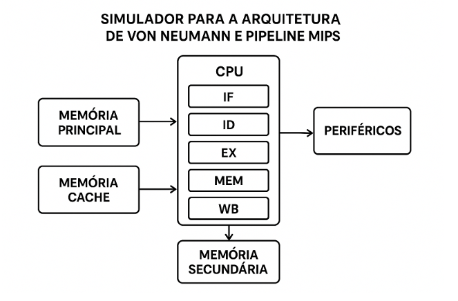
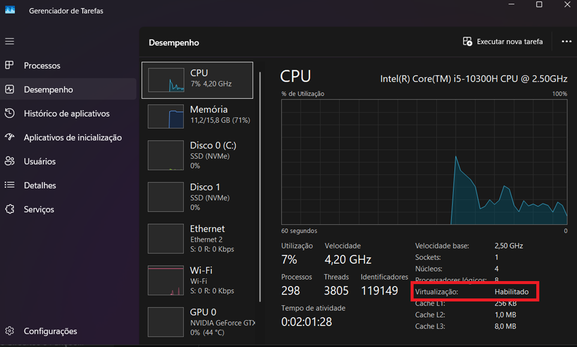
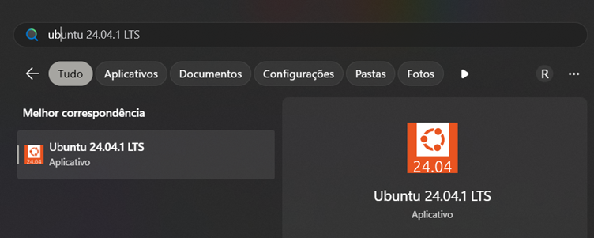
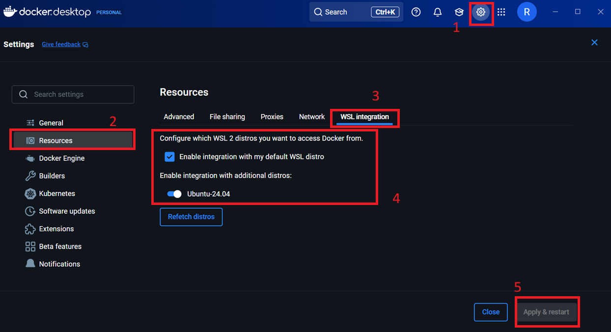

<p align="center"> 
  
</p>

<h1 align="center">
🖥️ Simulador Multicore Von Neumann
</h1>

<h3 align="center">
Arquitetura Multicore com Pipeline MIPS, Escalonamento e Gerenciamento de Memória
</h3>

<div align="center">


</div>

---

<div align="justify">
<p><strong>Disciplina:</strong> Sistemas Operacionais<br>
<strong>Instituição:</strong> Centro Federal de Educação Tecnológica de Minas Gerais (CEFET-MG) - Campus V Divinópolis<br>
<strong>Professor:</strong> Michel Pires da Silva<br>
<strong>Projeto:</strong> Trabalho Final - Simulação de Arquitetura Multicore com Gerenciamento de Memória e Escalonamento<br>
</div>


---

## 📖 Índice

- [Sobre o Projeto](#-sobre-o-projeto)
  - [Evolução do Simulador](#-evolução-do-simulador)
  - [Conformidade com o Enunciado](#-conformidade-com-o-enunciado)
  - [Componentes Implementados](#-componentes-implementados)
- [Fundamentos da Arquitetura Von Neumann](#️-fundamentos-da-arquitetura-von-neumann)
- [Organização do Código-Fonte](#️-organização-do-código-fonte)
- [Componentes da CPU](#️-componentes-da-cpu)
  - [Pipeline MIPS](#pipeline-mips-de-5-estágios)
  - [ULA (Unidade Lógica Aritmética)](#ula-unidade-lógica-aritmética)
  - [Registradores](#registradores)
  - [Banco de Registradores](#banco-de-registradores)
  - [Unidade de Controle](#unidade-de-controle)
  - [Process Control Block (PCB)](#process-control-block-pcb)
- [Sistema de Memória](#-sistema-de-memória)
  - [Hierarquia de Memória](#hierarquia-de-memória-3-níveis)
  - [Memória Principal (RAM)](#memória-principal-ram)
  - [Memória Secundária (Disco/Swap)](#memória-secundária-discoswap)
  - [Cache L1](#cache-l1)
  - [Políticas de Substituição](#políticas-de-substituição-fifolru)
  - [Segmentação (Modelo Tanenbaum)](#segmentação-modelo-tanenbaum)
- [Políticas de Escalonamento](#-políticas-de-escalonamento)
- [Rastreamento Temporal de Memória](#️-rastreamento-temporal-de-memória)
- [Sistema de I/O](#-sistema-de-io)
- [Métricas de Desempenho](#-métricas-de-desempenho)
- [Lote Inicial de Processos](#-lote-inicial-de-processos)
- [Como Compilar e Executar](#-como-compilar-e-executar)
  - [Instalação Rápida](#instalação-rápida)
  - [Comandos Disponíveis](#comandos-disponíveis)
  - [Executando o Simulador](#executando-o-simulador)
- [Visualização de Resultados](#-visualização-de-resultados)
- [Configuração do Ambiente (Docker/WSL)](#-configuração-do-ambiente-dockerwsl)
- [Estrutura do Projeto](#️-estrutura-do-projeto)
- [Decisões de Projeto](#-decisões-de-projeto)
- [Colaboradores](#-colaboradores)
- [📄 Licença](#-licença)
- [📚 Referências](#-referências)

---

## Sobre o Projeto

<div align="justify">

Este projeto implementa um **simulador completo de arquitetura multicore Von Neumann** com pipeline MIPS, desenvolvido em duas fases para a disciplina de Sistemas Operacionais:

### Evolução do Simulador

**Fase 1 - Trabalho de Aquecimento (Base):**
- Implementação da arquitetura Von Neumann clássica
- Pipeline MIPS de 5 estágios (IF → ID → EX → MEM → WB)
- Componentes básicos: ULA, Registradores, Memórias
- Sistema de I/O com dispositivos periféricos
- Divisão por equipes: CPU, Memórias, Periféricos, Suporte

**Fase 2 - Trabalho Final (Extensões):**
- **Arquitetura Multicore**: Até 8 núcleos com threads C++ reais
- **Gerenciamento de Memória Avançado**: Segmentação Tanenbaum + Cache L1 (FIFO/LRU)
- **Políticas de Escalonamento**: FCFS, SJN, Priority, Round Robin
- **Rastreamento Temporal**: Snapshots de memória a cada 10 ciclos
- **Métricas Completas**: Tempo de espera, retorno, throughput, cache hit rate
- **Visualização**: 12 gráficos comparativos gerados automaticamente

### Conformidade com o Enunciado

O simulador atende **100% dos requisitos técnicos** especificados no trabalho final:

| Requisito | Implementação |
|-----------|---------------|
| Arquitetura Multicore (1-8 cores)  | `std::thread` com sincronização mutex |
| Lote inicial de programas  | 9 processos carregados do disco |
| Memória compartilhada unificada  | Acesso sincronizado entre cores |
| Segmentação Tanenbaum  | 4 segmentos (CODE, DATA, STACK, HEAP) |
| Políticas de substituição  | FIFO e LRU implementadas |
| 4 Políticas de escalonamento  | FCFS, SJN, Priority, RR |
| Cenário não-preemptivo  | FCFS, SJN, Priority (run-to-completion) |
| Cenário preemptivo  | Round Robin (quantum=5 ciclos) |
| Métricas de desempenho  | Todas as métricas especificadas |
| Relatórios de escalonamento  | Comparação entre políticas |
| Utilização temporal de memória  | Snapshots automáticos + relatórios |

### Componentes Implementados

| Componente | Descrição | 
|------------|-----------|
| **Pipeline MIPS** | 5 estágios (Fetch → Decode → Execute → Memory → WriteBack) |
| **Multicore** | 1-8 cores com threads C++ e sincronização | 
| **Escalonamento** | 4 políticas (FCFS, SJN, Priority, RR) | 
| **Memória Segmentada** | Modelo Tanenbaum com 4 segmentos | 
| **Cache FIFO/LRU** | Políticas de substituição implementadas |
| **Hierarquia Memória** | 3 níveis (Cache → RAM → Swap) | 
| **Rastreamento Temporal** | Snapshots a cada 10 ciclos | 
| **Relatórios** | Individuais e agregados do sistema | 
| **Visualização** | 12 gráficos comparativos (Python/matplotlib) | 

</div>

---

## Fundamentos da Arquitetura Von Neumann

<div align="justify">

Segundo a proposta do trabalho, a **arquitetura de Von Neumann**, concebida por John von Neumann na década de 1940, constitui a base conceitual dos sistemas computacionais modernos. Essa arquitetura caracteriza-se pelo uso de uma **única memória compartilhada** para armazenamento de dados e instruções, característica que origina o fenômeno conhecido como **Von Neumann bottleneck**.

Essa limitação decorre do fato de que processador e memória disputam o mesmo barramento de comunicação, restringindo a taxa de transferência e, consequentemente, comprometendo o desempenho do sistema.

### Soluções Implementadas para Mitigar o Bottleneck

Com o intuito de mitigar esse problema, a evolução da computação incorporou soluções fundamentadas na **organização hierárquica da CPU, dos barramentos e da memória**:

1. **Memória Cache**: Atua como intermediária entre CPU e RAM, com elevada velocidade de acesso e capacidade limitada, armazenando dados frequentemente utilizados.

2. **Pipeline MIPS**: Permite execução sobreposta de instruções, aumentando throughput sem aumentar frequência de clock.

3. **Arquitetura Multicore**: Múltiplos núcleos compartilham a memória, permitindo paralelismo real.

4. **Hierarquia de Memória**: Três níveis (Cache L1 → RAM → Swap) com diferentes velocidades e capacidades.

5. **DMA (Direct Memory Access)**: Acesso direto à memória por dispositivos periféricos sem intervenção da CPU.

### Diagrama da Arquitetura Base

Este trabalho foi baseado no seguinte diagrama proposto de arquitetura:

</div>

<div align="center">



</div>

<div align="justify">

### Divisão em Equipes (Fase 1)

Para a elaboração deste trabalho, a turma foi dividida em 4 grupos especializados:

- **Equipe CPU**: Implementação da CPU com pipeline MIPS e conjunto de instruções
- **Equipe Memórias**: Implementação das memórias principal, secundária e cache
- **Equipe Periféricos**: Dispositivos de I/O, parser JSON e programas de teste
- **Equipe Suporte**: Integração dos sistemas, documentação, Docker e gerenciamento

</div> 

 


## Organização do Repositório
Com base nos arquivos gerados, podemos definir propriamente em qual parte da arquitetura cada um deles pertence, como ficou definido no resumo a seguir:

### Arquivos da CPU
#### Unidade de Controle (UC):
- `CONTROL_UNIT.cpp`
- `CONTROL_UNIT.hpp`
#### PCB:
- `PCB.hpp`
- `pcb_loader.cpp`
- `pcb_loader.hpp`
#### Registradores:
- `HASH_REGISTER.hpp`
- `REGISTER.hpp`
- `REGISTER_BANK.cpp`
- `REGISTER_BANK.hpp`
#### Unidade Lógica e Aritmética (ULA):
- `ULA.cpp`
- `ULA.hpp`
- `ULA.o`


### Arquivos das Memórias
#### Memórias principal e secundária:
- `MAIN_MEMORY.hpp`
- `MAIN_MEMORY.cpp`
- `SECONDARY_MEMORY.hpp`
- `SECONDARY_MEMORY.cpp`


### Arquivos Cache (Memória Cache)
- `cache.hpp`
- `cache.cpp`
- `cachePolicy.hpp`
- `cachePolicy.cpp`


### Arquivos dos Periféricos
- `IOManager.hpp`
- `IOManager.cpp`


## Sobre a CPU

### `ULA.hpp/.cpp`:

<div align="justify">
<p>A Unidade Lógica Aritmética é o componente responsável por realizar as operações necessárias (sendo estas matemáticas e lógicas) para o entendimento da máquina acerca das instruções.</p>

<p>Esta é essencial para a estrutura e comportamento de toda máquina, visto que ela opera os números binários à baixo nível. Há-se também uma <i>flag</i> nomeada como <b>overflow</b>, que indica caso o resultado ultrapasse a capacidade de interpretação da ULA. Dentre as operações implementadas, temos:</p>
</div>


#### ADD:
* **Tipo:** Aritmética
* **Descrição:** Soma dois operandos e armazena o resultado. (com detecção de overflow signed)
#### SUB
* **Tipo:** Aritmética
* **Descrição:** Subtrai o segundo operando em relação ao primeiro e armazena o resultado. (com detecção de overflow signed)
#### MUL
* **Tipo:** Aritmética
* **Descrição:** Multiplica dois operandos e armazena o resultado. (com detecção de overflow signed)
#### DIV
* **Tipo:** Aritmética
* **Descrição:** Divide o primeiro operando em relação ao segundo e armazena o resultado. (com detecção de overflow signed, trata divisão por zero).
#### AND_OP
* **Tipo:** Lógica
* **Descrição:** Compara os dois operandos como uma porta lógica "AND" e armazena o resultado. (tratando ambos como unsigned)
#### BEQ (Branch if Equal)
* **Tipo:** Lógica
* **Descrição:** Compara os dois operandos, resulta 1 se forem iguais e 0 caso contrário. 
#### BNE (Branch if Not Equal)
* **Tipo:** Lógica
* **Descrição:** Compara os dois operandos, resulta 1 se forem distintos e 0 caso contrário.
#### BLT (Branch if Less Than)
* **Tipo:** Lógica
* **Descrição:** Compara os dois operandos, resulta 1 se o primeiro operando for **menor** que o segundo, e 0 caso contrário.  (signed)
#### BGT (Branch if Greater Than)
* **Tipo:** Lógica
* **Descrição:** Compara os dois operandos, resulta 1 se o primeiro operando for **maior** que o segundo, e 0 caso contrário. (signed)
#### BGTI (Branch if Greater Than Immediate)
* **Tipo:** Lógica
* **Descrição:** Compara os dois operandos, resulta 1 se o primeiro operando for **maior** que o segundo, e 0 caso contrário. (Convenção do operando B [segundo] conter o imediato)
#### BLTI (Branch if Less Than Immediate)
* **Tipo:** Lógica
* **Descrição:** Compara os dois operandos, resulta 1 se o primeiro operando for **menor** que o segundo, e 0 caso contrário. (Convenção do operando B [segundo] conter o imediato)
* OBS: Todas operações do tipo Branch realizam **salto** de instrução;
#### LW (Load Word)
- **Tipo:** Dados
- **Descrição:** Carrega um valor da memória para um registrador
#### LA (Load Address)
- **Tipo:** Dados
- **Descrição:** Carrega um endereço da memória para um registrador
#### ST (Store)
- **Tipo:** Dados
- **Descrição:** Armazena um valor de um registrador para uma posição na memória.
### Atributos:

- `A`, `B`: Entradas A e B da ALU, que recebem operandos de 32 bits (através do uint_32).
- `result`: Resultado da operação (32 bits signed).
- `overflow`: Flag de overflow.
- `op`: Operação a ser realizada.
### Funções:
- `calculate()`: Executa a operação especificada.
- `execute():` Recebe os operandos e a operação para realizar o cálculo.

## `REGISTER.hpp/.cpp`:

<div align="justify">
<p>Unidade individual de armazenamento, usado de diversas maneiras como para armazenas dados temporários utilizados pela ULA, endereços de memórias para busca dentro da mesma e informações de controle para funcionamento completo da estrutura.</p>
</div>

O registrador possui:
- `value:` o valor do registrador, representado por um uint_32 (uma palavra de 32 bits), e inicializado em 0 por convenção através do construtor.
- `write():` responsável por escrever um novo valor no registrador. (OBS: sem proteção de escritad no R0)
 - `read():` responsável por retornar o valor atual do registrador, utiliza-se *const* para evitar a modificação do registrador.
 - `reverse_read():` responsável por retornar o valor com os bytes invertidos (chamado *endianness swap*). 


## `HASH_REGISTER.hpp/.cpp`:

<div align="justify">
<p>Estes arquivos são responsáveis por fazer o mapeamento dos registradores utilizados pela Unidade de Controle. Tem-se a implementação completa e correta da especificação MIPS R3000/R4000:</p>

- R0 (zero): Sempre contém 0 (hardwired)
- R1 (at): Assembler temporário
- R2-R3 (v0-v1): Resultados de Função
- R4-R7 (a0-a3): Argumentos de Função
- R8-R15 (t0-t7): Registradores Temporários
- R16-R23 (s0-s7): Registradores de Salvamento
- R24-R25 (t8-t9): Mais Registradores Temporários
- R26-R27 (k0-k1): Reservado para o Kernel
- R28-R31 (gp, sp, fp, ra): Propósitos Especiais
	- R0 -> R31: Registradores de **propósito geral**
	- Registradores especiais: **PC, MAR, IR, HI, LO, SR, EPC, CR**

Utilizou-se std::unordered_map (com custo de O(1) amortizado) para melhoria da performance de acesso aos registradores. E uma implementação de auxílio para acessos mais rápidos e frequentes.

Todo registrador possui um **nome, tipo, uma variável de disponibilidade e uma descrição**.  

Tem-se na classe de `RegisterMapper`, mapas bidirecionais para uma performance otimizada de busca. Sendo eles de *binário para nome/nome para binário e um com os metadados dos registradores.*


## `REGISTER_BANK(.hpp e .cpp)`:

<div align="justify">
<p>O banco de registradores é, na teoria, **a memória mais rápida da CPU**. Ele funciona como uma "mesa de trabalho" para o processador, guardando os dados que estão sendo usados no momento, como o resultado de uma soma ou o endereço da próxima instrução.</p>

<p>Na prática, aqui no nosso código, o REGISTER_BANK é uma <b>classe que agrupa todos os registradores do MIPS como objetos individuais</b>. A ideia é que, em vez de acessar um registrador por um número (como o registrador 16), a Control Unit pode simplesmente pedir pelo nome ("s0"), usando os mapas que a gente criou. Isso deixa o código do resto do grupo muito mais fácil de ler e entender.</p>

**Registradores de uso específico:** 
- `REGISTER pc, mar, cr, epc, sr, hi, lo, ir;`

**Registradores de uso geral:** 
- `REGISTER zero, at; REGISTER v0, v1; REGISTER a0, a1, a2, a3; REGISTER t0, t1, t2, t3, t4, t5, t6, t7, t8, t9; REGISTER s0, s1, s2, s3, s4, s5, s6, s7; REGISTER k0, k1; REGISTER gp, sp, fp, ra;`
## Funções:
- `REGISTER_BANK()`: Ele preenche os mapas que associam os nomes dos registradores (ex: "t0")  às suas funções de leitura e escrita. É aqui que a mágica do acesso por nome acontece.
- `readRegister()`: Lê um registrador usando o nome como string. Lança um erro se o nome for inválido.
- `writeRegister()`: Escreve em um registrador usando o nome. A proteção do registrador "zero" é garantida aqui.
- `reset()`: Zera todos os registradores. Serve para limpar o estado da CPU entre processos.
- `print_registers()`: Função de ajuda para debug. Imprime o valor de todos os registradores de forma organizada na tela.

## PCB.hpp (Formato e Métricas)

**Campos principais (resumo)**:
- `pid` (int): identificador único do processo.
- `state` (enum): {NEW, READY, RUNNING, BLOCKED, TERMINATED}.
- `priority` (int): prioridade do processo (maior valor = maior prioridade).
- `quantum` (int): fatia de tempo (em ciclos) para escalonador round-robin.
- `cache_hits` / `cache_misses` (uint64): contadores de cache por processo.
- `memory_cycles` (uint64): contagem de ciclos atribuídos a acessos à memória para este processo.
- `io_cycles` (uint64): contagem de ciclos gastos em I/O.

**MemWeights**
- Conjunto de pesos (`memWeights.cache`, `memWeights.main`, `memWeights.secondary`) usado para calcular custo em ciclos quando o processo acessa cada camada de memória.

**JSON de entrada (pcb_loader)**
- O `pcb_loader` aceita um JSON com chaves obrigatórias: `pid`, `priority`, `quantum`, `initial_pc` e opcional `memWeights`. Exemplo:
```json
{
  "pid": 1,
  "priority": 5,
  "quantum": 5,
  "initial_pc": 0,
  "memWeights": { "cache": 1, "main": 10, "secondary": 100 }
}
```

## `CONTROL_UNIT.hpp/.cpp`:

<div align="justify">
<p>A Unidade de Controle é uma das partes mais cruciais da CPU que coordena e gerencia a execução de instruções no processador. Ela atua como o centro pensativo da CPU, determinando quais operações devem ser realizadas, em qual ordem e com quais dados. As instruções citadas no ciclo da CPU e da Pipeline são definidas e realizadas aqui, na ordem necessária e solicitada pelo sistema.</p>

<p>Lê instruções da memória, decodifica quais registradores e imediatos usar, manda as operações para a ULA (ALU), faz acesso à memória (load/store) e gera pedidos de I/O (print). Tudo isso dividido em 5 etapas (pipeline): IF, ID, EX, MEM, WB.</p>

### Helpers:
- `binaryStringToUint(...)`  -> transforma uma string de '0'/'1' em número.
- `signExtend16(...)`  -> transforma um imediato de 16 bits em 32 bits preservando o sinal (two's complement).

### Utilitários para extrair campos da instrução de 32 bits:
- `Get_immediate(...)`  -> pega os 16 bits de imediato.
- `Pick_Code_Register_Load(...)`  -> pega o campo rt (bits 11..15).
- `Get_destination_Register(...)` -> pega rd (bits 16..20).
- `Get_target_Register(...)`  -> pega rt (bits 11..15).
- `Get_source_Register(...) `  -> pega rs (bits 6..10).

O Ciclo implementado no MIPS (através do pseudoparalelismo de pipeline) há-se descrito a seguir:
- `void Fetch(ControlContext &context):` busca instrução da memória;
- `void Decode(REGISTER_BANK &registers, Instruction_Data &data):`  decodifica campos;
- `void Execute_Aritmetic_Operation(REGISTER_BANK &registers, Instruction_Data &d):` usa ULA para ALU-ops;
- `void Execute_Operation(Instruction_Data &data, ControlContext &context):`  branches /saltos / syscalls (chamadas do sistema);
- `void Execute_Loop_Operation(REGISTER_BANK &registers, Instruction_Data &d,int &counter, int &counterForEnd, bool &endProgram, MainMemory &ram, PCB &process):`Loop principal;
- `void Execute(Instruction_Data &data, ControlContext &context):`  dispatcher de execução;
- `void Memory_Acess(Instruction_Data &data, ControlContext &context):` LW / SW (depende de MainMemory);
- `void Write_Back(Instruction_Data &data, ControlContext &context);`  grava resultado no banco de registradores;
### Acerca da Execução
- **Identificação de instrução:**
	- `Identificacao_instrucao(...)` -> lê os 6 bits do opcode e tenta retornar uma string com o nome da instrução ("ADD", "LW", "J", ...). *OBS:* o mapeamento está simplificado; R-type com opcode 000000 tenta usar o campo 'funct' para inferir ADD/SUB/MULT/DIV.
  - **Estágios do pipeline (explicação direta):**
      * Fetch(context)   -> busca a instrução na memória usando o PC e escreve em IR. Também detecta um sentinel de fim de programa.
      * Decode(regs, d)  -> lê a IR, identifica o mnemonic e preenche os campo em Instruction_Data (registradores, imediato, etc).   Faz sign-extend dos imediatos quando necessário.
      * Execute(...)     -> dispatcher que decide qual execução fazer:
		   - Execute_Aritmetic_Operation(...) para ADD/SUB/...
		   - Execute_Loop_Operation(...) para BEQ/J/BLT/...
		   - Execute_Operation(...) para PRINT / I/O
	* Memory_Acess(...)-> realiza LW, SW, LA, LI e leitura para PRINT de endereços de memória.
      * Write_Back(...)  -> grava na memória em caso de SW (ou outros writes se adicionados).


## Sobre as Memórias
Neste módulo da memória do simulador está dividido em três componentes principais:

- **Memória Principal (RAM)** — implementada em [`MAIN_MEMORY.hpp`](src/memory/MAIN_MEMORY.hpp) e [`MAIN_MEMORY.cpp`](src/memory/MAIN_MEMORY.cpp).  
- **Memória Secundária (disco/armazenamento permanente)** — implementada em [`SECONDARY_MEMORY.hpp`](src/memory/SECONDARY_MEMORY.hpp) e [`SECONDARY_MEMORY.cpp`](src/memory/SECONDARY_MEMORY.cpp).  
- **Gerenciador de Memória (MemoryManager)** — interface que unifica acesso às duas memórias e faz a tradução de endereços lógicos para cada espaço. Implementado em [`MemoryManager.hpp`](src/memory/MemoryManager.hpp) e [`MemoryManager.cpp`](src/memory/MemoryManager.cpp).

---

### MAIN_MEMORY
**Papel:** simular a memória principal (RAM) como um vetor linear de palavras (`vector<uint32_t>`).

**Comportamento principal (funções):**
- **Construtor** — [`MAIN_MEMORY::MAIN_MEMORY`](src/memory/MAIN_MEMORY.cpp#L3) recebe o tamanho desejado, ajusta pelo `MAX_MEMORY_SIZE` e inicializa com `MEMORY_ACCESS_ERROR`.  
- [`isEmpty()`](src/memory/MAIN_MEMORY.cpp#L18) — percorre o vetor e retorna `true` se todas as posições forem `0`.  
- [`notFull()`](src/memory/MAIN_MEMORY.cpp#L25) — verifica se existe alguma posição igual a `0` (há espaço livre).  
- [`ReadMem(uint32_t address)`](src/memory/MAIN_MEMORY.cpp#L32) — retorna o conteúdo em `address` se válido; senão `MEMORY_ACCESS_ERROR`.  
- [`WriteMem(uint32_t address, uint32_t data)`](src/memory/MAIN_MEMORY.cpp#L39) — escreve `data` se `address` válido; caso contrário retorna `MEMORY_ACCESS_ERROR`.  
- [`DeleteData(uint32_t address)`](src/memory/MAIN_MEMORY.cpp#L49) — devolve o valor salvo e marca a célula com `MEMORY_ACCESS_ERROR`.

A RAM é representada por um `vector<uint32_t> ram` redimensionado para `size`. Inicialmente todas as posições são preenchidas com `MEMORY_ACCESS_ERROR`.  

---

### SECONDARY_MEMORY
**Papel:** simular a memória secundária (disco) como uma estrutura 2D (matriz).

**Comportamento principal (funções):**
- **Construtor** — [`SECONDARY_MEMORY::SECONDARY_MEMORY`](src/memory/SECONDARY_MEMORY.cpp#L3) limita o tamanho a `MAX_SECONDARY_MEMORY_SIZE`, calcula `rowSize` e inicializa `storage` com `MEMORY_ACCESS_ERROR`.  
- [`isEmpty()`](src/memory/SECONDARY_MEMORY.cpp#L19) — percorre todas as células e retorna `true` se todas forem `0`.  
- [`notFull()`](src/memory/SECONDARY_MEMORY.cpp#L27) — retorna `true` se houver alguma célula igual a `0`.  
- [`ReadMem(uint32_t address)`](src/memory/SECONDARY_MEMORY.cpp#L45) — converte `address` em `(row, col)` e retorna o conteúdo se válido; senão `MEMORY_ACCESS_ERROR`.  
- [`WriteMem(uint32_t address, uint32_t data)`](src/memory/SECONDARY_MEMORY.cpp#L52) — escreve `data` na célula se válido; senão `MEMORY_ACCESS_ERROR`.  
- [`DeleteData(uint32_t address)`](src/memory/SECONDARY_MEMORY.cpp#L62) — devolve o valor e marca a célula com `MEMORY_ACCESS_ERROR`.

A implementação usa uma **matriz quadrada** baseada em `sqrt(MAX_SECONDARY_MEMORY_SIZE)`.  
Para converter um endereço linear em coordenadas da matriz, são usados os métodos  
[`getRow(uint32_t address)`](src/memory/SECONDARY_MEMORY.cpp#L35), que retorna a linha (`address / rowSize`),  
e [`getCol(uint32_t address)`](src/memory/SECONDARY_MEMORY.cpp#L40), que retorna a coluna (`address % rowSize`).  
Esses métodos garantem que cada posição linear seja mapeada corretamente dentro da estrutura 2D da memória secundária.

<!-- 
---
### MemoryManager
**Papel:** camada de abstração que unifica leituras e escritas.

.......... -->

---

### Comportamento de erro e marcação de células
- Em operações inválidas (endereço fora do limite) as funções retornam `MEMORY_ACCESS_ERROR`.  
- Em deleções bem-sucedidas, a célula é marcada com `MEMORY_ACCESS_ERROR`.
do)


## Cache (Memória Cache)

Seu objetivo é reduzir o tempo médio de acesso à memória principal (RAM), diminuindo a latência do processador. A cache funciona como um intermediário inteligente entre a CPU e a memória principal, utilizando bits de controle como `isValid` e `isDirty` para gerenciar a coerência e consistência dos dados.  
O bit `isValid` garante que uma linha possui dados utilizáveis, enquanto o `isDirty` indica modificações ainda não propagadas à RAM (write-back pendente).

### Estrutura da Cache

| Data | isValid | isDirty |
|------|---------|---------|
| Valor armazenado | Válido? | Sujo? |

- **Data** — Valor efetivo armazenado (dado real).  
- **isValid** — Indica se a entrada contém um dado válido.  
- **isDirty** — Indica se o dado foi alterado na cache e ainda não foi gravado na memória principal.  

---

**Endereçamento e granularidade**
- `address` nas funções públicas da cache representa um *índice de palavra* (word address). Cada palavra tem 4 bytes. Se chamar `Cache::get(0)` retorna o conteúdo da primeira palavra. (Se o teu código usa bytes, converte `byte_offset/4` antes de usar a cache.)

**Métricas**
- `get_hits()` e `get_misses()` retornam os contadores agregados desde a inicialização. Reset manual pode ser feito re-criando o objeto `Cache` ou adicionando um método `resetMetrics()`.

### Comportamento principal (funções)

- **Construtor** — [`Cache::Cache`](src/memory/cache.cpp#L5) inicializa a estrutura com a capacidade máxima e zera métricas (`cache_hits`, `cache_misses`).  

- [`Cache::get(size_t address)`](src/memory/cache.cpp#L16) busca o dado pelo `address`/`tag`.  
  - Se encontrar com `isValid = true` → **cache hit** (retorna o valor e incrementa `cache_hits`).  
  - Caso contrário → **cache miss** (retorna `CACHE_MISS` e incrementa `cache_misses`).  

- [`Cache::put(size_t address, size_t data, MemoryManager* memManager)`](src/memory/cache.cpp#L26) insere/substitui bloco.  
  - Se a cache estiver cheia, aplica **FIFO (First In, First Out)**.  
  - Se o bloco removido estiver **sujo** (`isDirty = true`), faz **write-back** via `MemoryManager`.  
  - Insere `{ data, isValid = true, isDirty = false }` e atualiza a fila FIFO.  

- [`Cache::update(size_t address, size_t data)`](src/memory/cache.cpp#L58) atualiza uma linha existente.  
  - Marca como **suja** (`isDirty = true`) e mantém `isValid = true`.  
  - Se o endereço não existir, **não** faz write-allocate.  

- [`Cache::invalidate()`](src/memory/cache.cpp#L73) define `isValid = false` em todas as entradas e esvazia a fila FIFO (reset/troca de contexto).  

- [`Cache::dirtyData()`](src/memory/cache.cpp#L82) retorna `{address, data}` de todas as linhas **sujas**, útil para **flush** consistente para a memória principal.  

---

### Política de substituição

A [`CachePolicy`](src/memory/cachePolicy.cpp) define a estratégia quando a cache atinge a capacidade.  
A implementação atual usa **FIFO (First In, First Out)**: **o primeiro bloco inserido é o primeiro a ser removido** (sem considerar acessos recentes).

- [`CachePolicy::getAddressToReplace(std::queue<size_t>& fifo_queue)`](src/memory/cachePolicy.cpp#L8) indica **qual endereço remover**.  
  - Se `fifo_queue` estiver vazia, retorna `-1`.  
  - Caso contrário, retorna e remove o **primeiro endereço inserido** na fila (seguindo a política FIFO).  


**Política de escrita**
- A cache implementa **write-back** com **no-write-allocate**:
  - `Cache::update(address, data)` marca a linha como *suja* (`isDirty = true`) se a entrada existir.
  - Se a entrada não existir, **não** aloca (não faz write-allocate). Em seguida deve ocorrer write direto à memória via `MemoryManager` (comportamento atual do sistema).

**Substituição**
- Política: **FIFO** (primeiro a entrar, primeiro a sair).  
- Ao substituir, se a linha removida estiver `isDirty=true`, a cache chama `MemoryManager::writeToFile` para write-back.


---

### Estrutura interna

A cache usa **`std::unordered_map`** para mapeamento `{address → CacheEntry}`, permitindo **acessos diretos e eficientes (O(1))** aos endereços armazenados.  
Isso melhora a performance global do sistema de memória, pois garante que as operações de leitura, escrita e verificação de presença na cache sejam rápidas, otimizando o desempenho.


## Sobre os Periféricos e I/O
### Estrutura dos Arquivos

* `IOManager.h`: Arquivo de cabeçalho da classe `IOManager`. Define a interface pública e os membros privados.
* `IOManager.cpp`: Arquivo de implementação da classe `IOManager`. Contém toda a lógica de funcionamento do gerenciador.
* `shared_structs.h`: Define estruturas de dados e enums (`PCB`, `IORequest`, `State`) que são compartilhados entre o `IOManager` e outros módulos.
* `main.cpp`: **Arquivo de simulação e exemplo de uso.** Ele cria um ambiente com processos e um escalonador para demonstrar a interação com o `IOManager`. main inicializa a configuração via CLI, carrega processos do ficheiro JSON, cria PCBs e inicializa os subsistemas (Cache, MemoryManager, Control Unit, Scheduler). Em seguida entra no loop de simulação: o scheduler seleciona processos, faz context switch, e a unidade de controle executa instruções ciclo-a-ciclo (fetch → decode → execute → memory → write-back), contabilizando métricas (ciclos, cache hits/misses). Ao término, main faz flush das linhas sujas da cache, escreve estatísticas e finaliza. Flags como --time-slice, --cache-capacity, --max-cycles controlam comportamento de runtime.


### Arquitetura do Projeto

O projeto do I/O é dividido em duas partes principais:

1.  **O Módulo `IOManager`**: É o núcleo deste trabalho. Sua responsabilidade agora é dupla:
    * **Simular Dispositivos**: Ele simula hardware (como impressora e disco) que, de forma independente, solicitam operações de I/O.
    * **Gerenciar Processos**: Ele mantém uma fila de processos que estão bloqueados esperando por I/O e os atribui aos dispositivos que se tornam ativos. Ele gera as requisições de I/O internamente.

2.  **O Ambiente de Simulação (`main.cpp`)**: Este código **não faz parte** do módulo `IOManager`. Ele atua como um "cliente" que utiliza o gerenciador, simulando:
    * A criação de Processos (PCBs).
    * Um escalonador de CPU (Round-Robin simples).
    * A decisão de um processo de solicitar uma operação de I/O, momento em que ele se "registra" no `IOManager` e fica bloqueado.

### Métodos Principais do `IOManager.cpp`

#### 1. `void IOManager::registerProcessWaitingForIO(PCB* process)`

Este é o **novo ponto de entrada** do `IOManager`. É a única função pública usada por sistemas externos para interagir com o gerenciador.

* **Responsabilidade**: Adicionar de forma segura um processo que entrou em estado `Blocked` a uma lista de espera interna.
* **Funcionamento**:
    1.  Recebe um ponteiro para o PCB do processo que precisa de I/O.
    2.  Utiliza um `std::lock_guard<std::mutex>` para bloquear o acesso à lista `waiting_processes` e evitar condições de corrida.
    3.  Adiciona o processo à lista de espera.

#### 2. `void IOManager::managerLoop()`

É uma função privada que executa em um loop infinito dentro de sua própria thread, representando o ciclo de vida do gerenciador. Sua lógica foi expandida e agora opera em três etapas principais a cada iteração:

* **Responsabilidade**: Simular dispositivos, combinar processos em espera com dispositivos ativos, criar requisições de I/O e processá-las.
* **Funcionamento**:
    1.  **Etapa 1: Simulação de Dispositivos**
        * De forma aleatória, o loop pode alterar o estado de um dos dispositivos (ex: `printer_requesting`) de `false` para `true`. Isso simula um periférico que agora precisa de serviço, representando o "estado 1" que foi solicitado.

    2.  **Etapa 2: Verificação e Criação de Requisições**
        * O gerenciador verifica duas condições simultaneamente: se há algum dispositivo com estado `true` E se há algum processo na `waiting_processes`.
        * Se ambas forem verdadeiras, ele "combina" os dois:
            * Pega o primeiro processo da fila de espera.
            * Cria uma estrutura `IORequest` específica para o dispositivo ativo (ex: `operation = "print_job"`).
            * **Atribui um custo aleatório de 1 a 3** à requisição.
            * Muda o estado do dispositivo de volta para `false` (ocupado ou atendido).
            * Adiciona a requisição recém-criada à fila de processamento interna.

    3.  **Etapa 3: Processamento da Requisição**
        * Se a fila de processamento não estiver vazia, a primeira requisição é retirada.
        * Simula o custo em tempo da operação usando `std::this_thread::sleep_for`.
        * Grava logs no console e nos arquivos `result.dat` e `output.dat`.
        * Ao final, **libera o processo** que estava bloqueado, alterando seu estado de volta para `State::Ready`, permitindo que ele volte a ser escalonado pela CPU.

### Saídas Geradas

* `result.dat`: Um arquivo de log em formato de texto, que descreve cada operação de I/O concluída.
* `output.dat`: Um arquivo de dados em formato CSV (`id,operação,duração`) para fácil importação e análise.


## Configuração do WSL e Docker

### Instalando e configurando o Dev Containers no Windows

Antes de começar, verifique se seu sistema atende a estes dois requisitos essenciais:

1.  **Versão do Windows:** Você precisa do Windows 10 (versão 2004 ou mais recente) ou qualquer versão do Windows 11.

2.  **Virtualização Habilitada na BIOS/UEFI:** O WSL 2 precisa que a virtualização de hardware esteja ativa.

     **Como verificar:**

        1.  Abra o **Gerenciador de Tarefas** (`Ctrl + Shift + Esc`).

        2.  Vá para a aba **Desempenho** e clique em **CPU**.

        3.  No canto inferior direito, procure por **Virtualização**. Deve estar **Habilitado**.




  **Se estiver desabilitado, você precisará reiniciar o computador, entrar na BIOS/UEFI (geralmente pressionando F2, F10 ou Del durante a inicialização) e ativar a opção (pode ter nomes como "Intel VT-x", "AMD-V" ou "SVM Mode").**

---
### Passo 1: Instalar o WSL (Subsistema do Windows para Linux)

1.  **Abra o PowerShell como Administrador:**
    * Clique com botão direito no Menu Iniciar, clique em `Windows PowerShell (Admin)` .

2.  **Execute o Comando de Instalação:**

    * Na janela do PowerShell, digite o seguinte comando e pressione Enter:
```powershell
 wsl --install
```

3.  **Reinicie o Computador:**

    * Após o comando terminar, ele pedirá que você reinicie. Salve seus trabalhos e reinicie.

4.  **Instale o Ubuntu:**

```powershell
  wsl --install -d Ubuntu
```
  

5.  **Configure o Ubuntu:**



    Após a instalação procure por Ubuntu no menu iniciar (Pode ser que não seja a mesma versão da image) e clique. Você precisará  configurar rapidamente, será pedido para você criar um **nome de usuário** e uma **senha** para o seu ambiente Linux. 

---
### O que fazer se o comando `wsl --install` falhar? (O Método Manual)


> Em versões mais antigas do Windows 10 ou em casos específicos, o comando único pode não funcionar. Se isso acontecer, você pode seguir o método antigo, que consiste em habilitar as funcionalidades manualmente.

  

**Execute os seguintes comandos no PowerShell como Administrador, um de cada vez:**

  

1.  **Habilitar a funcionalidade "Subsistema do Windows para Linux":**

```powershell
dism.exe /online /enable-feature /featurename:Microsoft-Windows-Subsystem-Linux /all /norestart     
```

  

2.  **Habilitar a funcionalidade "Plataforma de Máquina Virtual":**
```powershell
dism.exe /online /enable-feature /featurename:VirtualMachinePlatform /all /norestart
```

3.  **Reinicie o computador.**

4.  **Baixe e instale o pacote de atualização do kernel do Linux:**

   - [Clique aqui para baixar o pacote do site da Microsoft](https://wslstorestorage.blob.core.windows.net/wslblob/wsl_update_x64.msi). Execute o instalador baixado.


5.  **Definir o WSL 2 como padrão:**

```powershell
wsl --set-default-version 2
```

6.  **Instale o Ubuntu:**

```powershell
wsl --install -d Ubuntu
```
  
7.  **Configure o Ubuntu:**

    Após a instalação procure por Ubuntu no menu iniciar e clique. Você precisará  configurar rapidamente, será pedido para você criar um **nome de usuário** e uma **senha** para o seu ambiente Linux.
    
---

### Passo 2: Instalar o Docker Desktop
  1.  **Baixe o Instalador:**

  - Vá para o site oficial: [**docker.com/products/docker-desktop/**](https://www.docker.com/products/docker-desktop/)

2.  **Execute o Instalador:**

    - Durante a instalação, certifique-se de que a opção **"Use WSL 2 instead of Hyper-V (recommended)"** esteja marcada.

3.  **Inicie e Configure o Docker Desktop:**

    - Após a instalação, inicie o Docker Desktop.

    - Faça um registro rápido na plataforma docker hub

    - Vá em **Settings > Resources > WSL Integration**.

    - Certifique-se de que o interruptor para a sua distribuição ("Ubuntu") esteja **ligado**.

    - Clique em **"Apply & Restart"**.



---
  
### Passo 3: Instalar e Configurar o Visual Studio Code

1.  **Instale a Extensão Dev Containers:**

    - No VS Code, vá para a aba de **Extensões** (`Ctrl + Shift + X`).

    - Procure por `Dev Containers` e instale a extensão da Microsoft.
  
---
### Passo 4: Testando Tudo!

1.  Clone este repositório.

2.  Clique em **"Reopen in Container"** quando o aviso aparecer, aguarde pois estárá sendo feito o download de todas as dependenciais necessárias do container. 

3. Abra o terminal do vscode e digite os seguintes comandos:
- `make teste`
 

## 🚀 Como Compilar e Executar

### Pré-requisitos

Para compilar e executar este projeto, você precisará ter os seguintes softwares instalados:

* **g++** (com suporte a C++17)
* **CMake** (versão 3.10 ou superior)
* **make**
* **Python 3** (opcional, para geração de gráficos)

### Instalação Rápida

O projeto possui um `Makefile` simplificado na raiz que **automatiza todo o processo**. Basta executar:

```bash
# 1️⃣ Clone o repositório
git clone https://github.com/Jottynha/SO-SimuladorVonNeumann.git
cd SO-SimuladorVonNeumann

# 2️⃣ Configure e compile (cria build/, executa cmake e compila tudo)
make

# 3️⃣ Execute o simulador
make run
```

**Pronto!** 🎉 O simulador está configurado e rodando.

#### O que acontece no `make`?

```bash
🔧 Configurando o projeto...
  📁 Criando diretório build/...
  ⚙️  Executando cmake...
✅ Configuração concluída!

🔨 Compilando o projeto...
[  2%] Building CXX object simulador.dir/src/main.cpp.o
[ 40%] Linking CXX executable simulador
[100%] Built target simulador
✅ Compilação concluída!
```

O Makefile automatiza:
1. **Criação do diretório `build/`**
2. **Execução do `cmake ..`** para gerar Makefiles
3. **Compilação com `make -j`** (usa todos os cores)
4. **Cópia dos arquivos JSON** (processos e tasks)

---

### Comandos Disponíveis

Execute `make help` para ver todos os comandos:

```bash
make help
```

**Tabela de Comandos:**

| Comando | Descrição |
|---------|-----------|
| **Configuração e Build** ||
| `make` | 🔧 Configura e compila o projeto completo (setup + build) |
| `make setup` | 📁 Cria diretório `build/` e executa `cmake` |
| `make build` | 🔨 Compila o simulador e testes |
| `make install-deps` | 📦 Instala dependências Python (matplotlib, pandas, etc.) |
| **Execução** ||
| `make run` | 🚀 Executa o simulador principal |
| `make test` | 🧪 Executa todos os testes |
| `make check` | ✅ Verificação rápida (PASSOU/FALHOU) |
| **Análise** ||
| `make plots` | 📊 Gera gráficos de análise de desempenho |
| **Limpeza** ||
| `make clean` | 🧹 Remove todo o diretório `build/` |
| `make clean-results` | 🗑️ Remove apenas resultados (.dat, .csv, .png) |
| **Ajuda** ||
| `make help` | ℹ️ Mostra lista completa de comandos |

---

### Compilação Manual (Alternativa)

Se preferir executar os comandos manualmente sem o Makefile wrapper:

```bash
# 1. Criar e acessar diretório de build
mkdir build
cd build

# 2. Configurar com CMake
cmake ..

# 3. Compilar (usando todos os cores disponíveis)
make -j$(nproc)

# 4. Executar
./simulador
```

---

### Executando o Simulador

Ao executar `make run` (ou `cd build && ./simulador`), você verá o menu interativo:

```
=== SIMULADOR DE ARQUITETURA MULTICORE VON NEUMANN ===

Digite o número de cores (1-8): 8
Configuração: 8 core(s)
Usar multi-threading? (s/n, padrão: s): s
Threading: HABILITADO (execução paralela)

Escolha o algoritmo de escalonamento:
1. FCFS (First-Come, First-Served)
2. SJN (Shortest Job Next)
3. Priority
4. Round Robin (RR)
5. Executar TODOS e Comparar
Digite sua escolha (1-5): 5

Executando FCFS (8 cores, multi-thread)...
[LOAD_PROCESSES] Carregando 9 processos...
Simulação concluída!
Tempo de execução: 12.77 ms

Executando SJN (8 cores, multi-thread)...
Simulação concluída!
Tempo de execução: 13.45 ms

[... continua com Priority e RoundRobin ...]

📊 Métricas salvas em: output/metrics_multi.csv
```

**Opções de execução:**

* **Número de cores**: 1 a 8
  - `1 core`: Execução sequencial (baseline)
  - `2-4 cores`: Paralelismo moderado
  - `8 cores`: Máximo paralelismo (recomendado para comparações)

* **Multi-threading**: 
  - `s` (sim): Usa threads C++ reais (execução paralela verdadeira)
  - `n` (não): Simulação sequencial (útil para debugging)

* **Escalonador**:
  - `1-4`: Executa um escalonador específico
  - `5`: **Recomendado** - Executa todos os 4 escalonadores e gera comparação completa

---

### Executando Testes

```bash
# Todos os testes
make test

# Verificação rápida
make check

# Testes individuais (a partir do diretório build/)
cd build
make test_ula      # Teste da ULA
make test_hash     # Teste do mapeamento de registradores
make test_bank     # Teste do banco de registradores
make test_metrics  # Teste de métricas da CPU
```

### Gerando Gráficos de Análise

Após executar o simulador com a opção 5, você pode gerar gráficos:

```bash
# Instalar dependências (primeira vez)
make install-deps

# Gerar gráficos
make plots
```

Os gráficos serão salvos em `plots/`:
- Comparação de tempos de execução
- Utilização de CPU por escalonador
- Cache hit rate
- Context switches
- E mais...

### Arquivos de Saída

O simulador gera vários arquivos de saída em `build/output/`:

| Arquivo | Conteúdo |
|---------|----------|
| `resultados_*_multicore.dat` | Logs detalhados de execução por escalonador |
| `comparacao_escalonadores_multicore_*cores.txt` | Tabela comparativa completa |
| `metrics_multi.csv` | Métricas agregadas para análise |
| `metrics_comparison_multicore_*.csv` | Comparação entre escalonadores |

### Limpeza

```bash
# Limpar tudo (remove build/)
make clean

# Limpar apenas resultados de simulação
make clean-results
```

---

## Personalização e Configuração para Testes

<div align="justify">

Esta seção descreve **como personalizar o simulador** para realizar experimentos e testes customizados. O sistema foi projetado para ser altamente configurável através de arquivos JSON e parâmetros de código.

### [1] Configuração de Processos (PCB)

**Localização:** `processes/process_*.json`

Cada processo é definido por um arquivo JSON que controla seu comportamento no escalonador.

**Exemplo de Estrutura:**

```json
{
  "pid": 1,
  "name": "Meu Processo Teste",
  "priority": 3,
  "quantum": 10,
  "arrival_time": 0,
  "memWeights": {
    "cache": 1,
    "main": 5,
    "secondary": 10
  }
}
```

**Parâmetros Configuráveis:**

| Parâmetro | Tipo | Descrição | Valores Recomendados |
|-----------|------|-----------|----------------------|
| `pid` | int | Identificador único do processo | 1-99 |
| `name` | string | Nome descritivo do processo | Qualquer string |
| `priority` | int | Prioridade (maior = mais prioritário) | 1-5 (1=alta, 5=baixa) |
| `quantum` | int | Quantum para Round Robin (ciclos) | 5-20 ciclos |
| `arrival_time` | int | Tempo de chegada (ms) | 0 ou mais |
| `memWeights.cache` | int | Custo em ciclos para acesso à cache | 1 (padrão) |
| `memWeights.main` | int | Custo em ciclos para acesso à RAM | 5-10 |
| `memWeights.secondary` | int | Custo em ciclos para acesso ao swap | 10-100 |

**Como Criar Novos Processos:**

1. Copie um arquivo existente: `cp processes/process_quick.json processes/process_meu_teste.json`
2. Edite os campos conforme necessário
3. Crie o arquivo de tarefas correspondente (veja seção 2)
4. Recompile e execute: `cd build && make run`

**Experimentos Sugeridos Pelos Autores:**
- **Teste de Prioridade**: Crie processos com prioridades diferentes (1, 3, 5) e observe o comportamento no escalonador Priority
- **Teste de Quantum**: Varie o quantum (5, 10, 20) e analise o número de context switches no Round Robin
- **Teste de Carga de Memória**: Ajuste `memWeights` para simular processos memory-intensive vs CPU-intensive

---

### [2] Programação de Tarefas (Assembly MIPS)

**Localização:** `tasks/tasks_*.json`

Define o **programa em assembly MIPS** que cada processo executará.

**Exemplo de Estrutura:**

```json
{
  "program": [
    { "instruction": "li", "rt": "$t0", "immediate": 100 },
    { "instruction": "li", "rt": "$t1", "immediate": 200 },
    { "instruction": "add", "rd": "$t2", "rs": "$t0", "rt": "$t1" },
    { "instruction": "print", "rt": "$t2" },
    { "instruction": "end" }
  ]
}
```

**Instruções Suportadas:**

| Instrução | Formato | Descrição | Exemplo |
|-----------|---------|-----------|---------|
| `li` | Load Immediate | Carrega imediato em registrador | `{ "instruction": "li", "rt": "$t0", "immediate": 42 }` |
| `add` | Soma | Soma dois registradores | `{ "instruction": "add", "rd": "$t0", "rs": "$t1", "rt": "$t2" }` |
| `sub` | Subtração | Subtrai dois registradores | `{ "instruction": "sub", "rd": "$t0", "rs": "$t1", "rt": "$t2" }` |
| `mul` | Multiplicação | Multiplica dois registradores | `{ "instruction": "mul", "rd": "$t0", "rs": "$t1", "rt": "$t2" }` |
| `div` | Divisão | Divide dois registradores | `{ "instruction": "div", "rd": "$t0", "rs": "$t1", "rt": "$t2" }` |
| `lw` | Load Word | Carrega palavra da memória | `{ "instruction": "lw", "rt": "$t0", "rs": "$t1", "immediate": 0 }` |
| `sw` | Store Word | Armazena palavra na memória | `{ "instruction": "sw", "rt": "$t0", "rs": "$t1", "immediate": 0 }` |
| `beq` | Branch if Equal | Salto condicional se igual | `{ "instruction": "beq", "rs": "$t0", "rt": "$t1", "label": 10 }` |
| `bne` | Branch if Not Equal | Salto condicional se diferente | `{ "instruction": "bne", "rs": "$t0", "rt": "$t1", "label": 10 }` |
| `j` | Jump | Salto incondicional | `{ "instruction": "j", "label": 5 }` |
| `print` | Print | Imprime valor (I/O) | `{ "instruction": "print", "rt": "$t0" }` |
| `end` | End | Finaliza programa | `{ "instruction": "end" }` |

**Registradores Disponíveis:**

- **Temporários**: `$t0` a `$t9` (10 registradores)
- **Salvos**: `$s0` a `$s7` (8 registradores)
- **Argumentos**: `$a0` a `$a3` (4 registradores)
- **Resultados**: `$v0` a `$v1` (2 registradores)
- **Zero**: `$zero` (sempre 0, read-only)

**Criando Programas Customizados:**

```bash
# Copiar template
cp tasks/tasks_quick.json tasks/tasks_meu_programa.json
# Editar com seu editor favorito
nano tasks/tasks_meu_programa.json
```

**Exemplos de Programas:**
**a) Loop Simples (10 iterações):**
```json
{
  "program": [
    { "instruction": "li", "rt": "$t0", "immediate": 0 },
    { "instruction": "li", "rt": "$t1", "immediate": 10 },
    { "instruction": "add", "rd": "$t0", "rs": "$t0", "immediate": 1 },
    { "instruction": "bne", "rs": "$t0", "rt": "$t1", "label": 2 },
    { "instruction": "end" }
  ]
}
```
**b) Acesso Intensivo à Memória:**
```json
{
  "program": [
    { "instruction": "li", "rt": "$t0", "immediate": 100 },
    { "instruction": "sw", "rt": "$t0", "rs": "$zero", "immediate": 0 },
    { "instruction": "lw", "rt": "$t1", "rs": "$zero", "immediate": 0 },
    { "instruction": "sw", "rt": "$t1", "rs": "$zero", "immediate": 4 },
    { "instruction": "lw", "rt": "$t2", "rs": "$zero", "immediate": 4 },
    { "instruction": "end" }
  ]
}
```
**c) Operações Aritméticas Intensivas (CPU-Bound):**
```json
{
  "program": [
    { "instruction": "li", "rt": "$t0", "immediate": 1000 },
    { "instruction": "li", "rt": "$t1", "immediate": 500 },
    { "instruction": "add", "rd": "$t2", "rs": "$t0", "rt": "$t1" },
    { "instruction": "mul", "rd": "$t3", "rs": "$t2", "rt": "$t0" },
    { "instruction": "div", "rd": "$t4", "rs": "$t3", "rt": "$t1" },
    { "instruction": "sub", "rd": "$t5", "rs": "$t4", "rt": "$t0" },
    { "instruction": "end" }
  ]
}
```
---

### [3] Configuração do Sistema (src/main.cpp)

**Localização:** `src/main.cpp`

Parâmetros globais do sistema podem ser alterados diretamente no código-fonte.

**Parâmetros Principais:**

```cpp
// Linha ~50-70: Configuração do sistema
const int NUM_CORES = 4;              // Número de cores (1-8)
const int CACHE_SIZE = 256;           // Tamanho da cache em blocos (64-1024)
const int SNAPSHOT_INTERVAL = 10;     // Intervalo de snapshots em ciclos (5-50)
// Linha ~100-120: Configuração de memória
const size_t RAM_SIZE = 4096;         // Tamanho da RAM em blocos (1024-8192)
const int CACHE_HIT_LATENCY = 1;      // Latência da cache em ciclos (1)
const int RAM_LATENCY = 5;            // Latência da RAM em ciclos (5-10)
const int SWAP_LATENCY = 10;          // Latência do swap em ciclos (10-100)
// Linha ~150-170: Configuração de escalonamento
SchedulingPolicy policy = ROUND_ROBIN;  // FCFS, SJN, PRIORITY, ROUND_ROBIN
const int DEFAULT_QUANTUM = 5;        // Quantum padrão para RR (5-20)
```

**Como Alterar:**

1. Abra o arquivo: `nano src/main.cpp`
2. Localize a seção de configuração (busque por "CONFIG" ou os valores acima)
3. Modifique os valores conforme necessário
4. Recompile: `cd build && cmake .. && make`
5. Execute: `./simulador`

**Experimentos Recomendados:**

| Parâmetro | Teste | Objetivo |
|-----------|-------|----------|
| `NUM_CORES` | Variar 1, 2, 4, 8 | Análise de speedup multicore |
| `CACHE_SIZE` | Variar 64, 128, 256, 512 | Impacto do tamanho da cache na taxa de hit |
| `DEFAULT_QUANTUM` | Variar 5, 10, 20 | Overhead de context switch vs interatividade |
| `RAM_LATENCY` | Variar 5, 10, 20 | Impacto da latência de memória no desempenho |

---

### [4] Políticas de Escalonamento (src/cpu/Scheduler.cpp)

**Localização:** `src/cpu/Scheduler.cpp`

**Como Alternar Entre Políticas:**

**Opção 1: Via Código (src/main.cpp)**

```cpp
// Linha ~160
// Altere o enum para a política desejada:
SchedulingPolicy policy = FCFS;          // First-Come, First-Served
// SchedulingPolicy policy = SJN;        // Shortest Job Next
// SchedulingPolicy policy = PRIORITY;   // Baseado em prioridade
// SchedulingPolicy policy = ROUND_ROBIN; // Round Robin (preemptivo)
```

**Opção 2: Via Interface do Simulador**

Quando executar o simulador, você verá um menu:

```
Selecione a política de escalonamento:
1. FCFS (First-Come, First-Served)
2. SJN (Shortest Job Next)
3. Priority (Baseado em Prioridade)
4. Round Robin (Preemptivo)
Escolha (1-4): _
```

**Modificando Algoritmos de Escalonamento:**

Para criar uma **nova política de escalonamento customizada**:

1. Abra `src/cpu/Scheduler.cpp`
2. Adicione um novo método:

```cpp
// Adicione após linha ~200
PCB* Scheduler::select_process_CUSTOM() {
    if (ready_queue.empty()) return nullptr;
    
    // Seu algoritmo customizado aqui
    // Exemplo: seleciona processo com menor PID
    PCB* selected = ready_queue[0];
    for (auto* process : ready_queue) {
        if (process->pid < selected->pid) {
            selected = process;
        }
    }
    
    // Remove da fila e retorna
    ready_queue.erase(
        std::remove(ready_queue.begin(), ready_queue.end(), selected),
        ready_queue.end()
    );
    
    return selected;
}
```

3. Adicione no enum (em `Scheduler.hpp`):

```cpp
enum SchedulingPolicy {
    FCFS,
    SJN,
    PRIORITY,
    ROUND_ROBIN,
    CUSTOM        // Sua nova política
};
```

4. Integre no dispatcher (em `Scheduler.cpp`, método `select_process`):

```cpp
PCB* Scheduler::select_process() {
    switch (policy) {
        case FCFS:        return select_process_FCFS();
        case SJN:         return select_process_SJN();
        case PRIORITY:    return select_process_Priority();
        case ROUND_ROBIN: return select_process_RoundRobin();
        case CUSTOM:      return select_process_CUSTOM();  // Nova linha
        default:          return nullptr;
    }
}
```

---

### [5] Políticas de Cache (src/memory/cachePolicy.cpp)

**Localização:** `src/memory/cachePolicy.cpp` e `src/memory/Cache.cpp`

**Como Alternar Entre FIFO e LRU:**

```cpp
// Em src/main.cpp, linha ~110
Cache cache(CACHE_SIZE, ReplacementPolicy::FIFO);  // FIFO
// Cache cache(CACHE_SIZE, ReplacementPolicy::LRU); // LRU
```

**Implementando Nova Política de Substituição:**

Exemplo: **Política RANDOM (aleatória)**

1. Adicione no enum (`src/memory/cachePolicy.hpp`):

```cpp
enum class ReplacementPolicy {
    FIFO,
    LRU,
    RANDOM    // Nova política
};
```

2. Implemente o algoritmo (`src/memory/cachePolicy.cpp`):

```cpp
size_t CachePolicy::getAddressToReplace_RANDOM(
    const std::unordered_map<size_t, CacheEntry>& cache_data
) {
    if (cache_data.empty()) return -1;
    
    // Gera índice aleatório
    size_t random_index = rand() % cache_data.size();
    
    // Itera até o índice aleatório
    auto it = cache_data.begin();
    std::advance(it, random_index);
    
    return it->first;  // Retorna endereço aleatório
}
```

3. Integre na classe Cache (`src/memory/Cache.cpp`):

```cpp
void Cache::put(size_t address, size_t data, MemoryManager* memManager) {
    if (cache_data.size() >= capacity) {
        size_t victim_addr;
        
        switch (policy) {
            case ReplacementPolicy::FIFO:
                victim_addr = cachePolicy.getAddressToReplace(fifo_queue);
                break;
            case ReplacementPolicy::LRU:
                victim_addr = cachePolicy.getAddressToReplace_LRU(lru_list);
                break;
            case ReplacementPolicy::RANDOM:
                victim_addr = cachePolicy.getAddressToReplace_RANDOM(cache_data);
                break;
        }
        
        // Remove vítima...
    }
}
```

---

### [6] Hierarquia de Memória (src/memory/)

**Localização:** `src/memory/MAIN_MEMORY.cpp`, `SECONDARY_MEMORY.cpp`

**Alterando Tamanhos de Memória:**

```cpp
// Em src/memory/MAIN_MEMORY.hpp, linha ~15
#define MAX_MEMORY_SIZE 4096        // RAM: 4096 blocos × 4 bytes = 16 KB
#define MEMORY_ACCESS_ERROR 0xDEADBEEF

// Em src/memory/SECONDARY_MEMORY.hpp, linha ~15
#define MAX_SECONDARY_MEMORY_SIZE 1000000  // Swap: ~4 MB
```

**Experimento: Simular Sistemas com Pouca Memória**

Reduza os valores para forçar mais swaps:

```cpp
#define MAX_MEMORY_SIZE 1024        // Apenas 4 KB de RAM
#define MAX_SECONDARY_MEMORY_SIZE 10000  // Swap limitado
```

Recompile e observe o aumento de acessos ao swap nos relatórios.

---

### [7] Ajustando Latências de Memória

**Localização:** `src/memory/MemoryManager.cpp`

```cpp
// Linha ~50-70
const int CACHE_LATENCY = 1;      // Ciclos para acesso à cache
const int RAM_LATENCY = 5;        // Ciclos para acesso à RAM
const int SWAP_LATENCY = 10;      // Ciclos para acesso ao swap

// No método de acesso:
uint32_t MemoryManager::read(uint32_t address, PCB& process) {
    // Tenta cache primeiro
    uint32_t value = cache.get(address);
    if (value != CACHE_MISS) {
        process.memory_cycles += CACHE_LATENCY;  // <-- Altere aqui
        process.cache_hits++;
        return value;
    }
    
    // Cache miss: tenta RAM
    value = ram.ReadMem(address);
    if (value != MEMORY_ACCESS_ERROR) {
        process.memory_cycles += RAM_LATENCY;    // <-- Altere aqui
        cache.put(address, value, this);
        return value;
    }
    
    // RAM miss: vai para swap
    value = swap.ReadMem(address);
    process.memory_cycles += SWAP_LATENCY;       // <-- Altere aqui
    return value;
}
```

**Experimento Sugerido:**

Simule um sistema com memória lenta:
- `CACHE_LATENCY = 1`
- `RAM_LATENCY = 20` (4x mais lento)
- `SWAP_LATENCY = 100` (10x mais lento)

Observe como isso afeta o tempo total de execução dos processos.

---

### [8] Snapshots de Memória (Intervalo de Captura)

**Localização:** `src/cpu/CONTROL_UNIT.cpp`

```cpp
// Linha ~400
const int SNAPSHOT_INTERVAL = 10;  // Captura a cada 10 ciclos

// No loop de execução:
snapshot_counter++;
if (snapshot_counter >= SNAPSHOT_INTERVAL) {  // <-- Altere SNAPSHOT_INTERVAL
    MemoryUsageTracker::recordSnapshot(process, cache_usage, ram_usage);
    snapshot_counter = 0;
}
```

**Granularidade Recomendada:**

| Intervalo | Uso | Overhead | Detalhamento |
|-----------|-----|----------|--------------|
| 1 ciclo | Debug detalhado | Alto | Máximo |
| 5 ciclos | Análise fina | Médio | Alto |
| 10 ciclos | **Padrão** (recomendado) | Baixo | Bom |
| 20 ciclos | Análise geral | Muito baixo | Moderado |
| 50 ciclos | Overview | Mínimo | Baixo |

---

### [9] Gerando Relatórios Customizados

**Localização:** `src/memory/MemoryUsageTracker.cpp`

**Adicionando Novas Métricas aos Relatórios:**

Exemplo: adicionar "Taxa de Swap" ao relatório agregado:

```cpp
// Em MemoryUsageTracker::generateAggregatedReport, linha ~150
void MemoryUsageTracker::generateAggregatedReport(...) {
    // ...existing code...
    
    // Adicione após linha de cache hit rate média:
    uint64_t total_swap_accesses = 0;
    uint64_t total_accesses = 0;
    
    for (const auto& process : processes) {
        total_swap_accesses += process->secondary_mem_accesses;
        total_accesses += process->total_memory_accesses;
    }
    
    double swap_rate = (total_accesses > 0) 
        ? (static_cast<double>(total_swap_accesses) / total_accesses) * 100.0 
        : 0.0;
    
    report << "Taxa de swap media: " << swap_rate << "%\n";
    
    // ...existing code...
}
```

---

### [10] Visualização de Dados (scripts Python)

**Localização:** `scripts/`

**Personalizando Gráficos:**

**a) Adicionar novo tipo de gráfico (`scripts/plot_results.py`):**

```python
# Adicione após linha ~180
def plot_custom_metric(data):
    """Plota métrica customizada"""
    import matplotlib.pyplot as plt
    fig, ax = plt.subplots(figsize=(10, 6))
    # Exemplo: gráfico de dispersão PID vs Cache Hit Rate
    pids = [p['pid'] for p in data]
    hit_rates = [p['cache_hit_rate'] for p in data]
    ax.scatter(pids, hit_rates, s=100, alpha=0.6)
    ax.set_xlabel('Process ID')
    ax.set_ylabel('Cache Hit Rate (%)')
    ax.set_title('Cache Hit Rate por Processo')
    ax.grid(True, alpha=0.3)
    plt.tight_layout()
    plt.savefig('../plots/custom_metric.png', dpi=300)
    plt.close()
    print("Gráfico customizado gerado: custom_metric.png")
# Chame a função no main:
if __name__ == '__main__':
    data = load_data()
    plot_custom_metric(data)
```

**b) Modificar cores e estilos:**

```python
# Em qualquer script, modifique paletas de cores:
import matplotlib.pyplot as plt

# Paleta padrão
colors = ['#FF6B6B', '#4ECDC4', '#45B7D1', '#FFA07A']

# Paleta customizada (ex: tons de azul)
colors = ['#1E3A8A', '#3B82F6', '#60A5FA', '#93C5FD']

# Use em seus plots:
ax.bar(x, y, color=colors)
```

**c) Gerar todos os gráficos de uma vez:**

```bash
# No diretório raiz do projeto
cd build
make plots

# Ou diretamente:
python3 ../scripts/plot_results.py
python3 ../scripts/plot_memory.py
python3 ../scripts/compare_schedulers.py
```

---

### Dicas Importantes

1. **Sempre recompile após alterações:** `cd build && make`
2. **Faça backup dos resultados:** `cp -r build/output/ resultados_experimento_X/`
3. **Use Git para versionar configurações:** `git commit -am "Experimento: 8 cores"`
4. **Documente seus testes:** Crie um arquivo `EXPERIMENTOS.md` com suas observações
5. **Valide resultados:** Execute múltiplas vezes para garantir reprodutibilidade

</div>

---

## Colaboradores

### EQUIPE CPU:
#### Elaboração da Unidade de Controle:
- João Pedro Rodrigues Silva ([jottynha](https://github.com/Jottynha))
- Pedro Augusto Gontijo Moura ([PedroAugusto08](https://github.com/PedroAugusto08))

#### Elaboração dos registradores:
- Anderson Rodrigues dos Santos ([anderrsantos](https://github.com/anderrsantos)) 

#### Elaboração do banco de registradores:
- Eduardo da Silva Torres Grillo ([EduardoGrillo](https://github.com/EduardoGrillo))

#### Elaboração da hash register:
- Álvaro Augusto José Silva ([alvaroajs](https://github.com/alvaroajs))
- Henrique de Freitas Araújo ([ak4ai](https://github.com/ak4ai)) 

#### Elaboração da ULA:
- Jader Oliveira Silva ([0livas](https://github.com/0livas))

### EQUIPE MEMÓRIAS:
#### Elaboração das Memórias Primária, Secundária e Cache:
- Guilherme Alvarenga de Azevedo ([alvarengazv](https://github.com/alvarengazv))
- João Paulo da Cunha Faria ([joaopaulocunhafaria](https://github.com/0livjoaopaulocunhafariaas))
- Joaquim Cezar Santana da Cruz ([JoaquimCruz](https://github.com/JoaquimCruz))
- Lucas Cerqueira Portela ([lucasporteladev](https://github.com/lucasporteladev))

#### Documentação das Memórias:
- Maria Eduarda Teixeira Souza ([dudatsouza](https://github.com/dudatsouza))
- Élcio Costa Amorim Neto ([elcioam](https://github.com/elcioam))

### EQUIPE PERIFÉRICOS:
#### Elaboração do programa e parser JSON:
- ⁠Eduardo Henrique Queiroz Almeida ([edualmeidahr](https://github.com/edualmeidahr))
- ⁠João Francisco Teles da Silva ([joaofranciscoteles](https://github.com/joaofranciscoteles))
- ⁠Maíra Beatriz de Almeida Lacerda ([mairaallacerda](https://github.com/mairaallacerda))

#### Elaboração do I/O:
- Bruno Prado dos Santos ([bybrun0](https://github.com/bybrun0))
- ⁠Sérgio Henrique Quedas Ramos ([serginnn](https://github.com/serginnn))

### EQUIPE SUPORTE:
#### Configuração do Docker e apoio à integrações na CPU:
- Gabriel Vitor Silva ([gvs22](https://github.com/gvs22))
- Rafael Adolfo Silva Ferreira ([radsfer](https://github.com/radsfer))
- Rafael Henrique Reis Costa ([RafaelReisyzx](https://github.com/RafaelReisyzx))

#### Documentação geral e apoio à integração das memórias:
- Lívia Gonçalves ([livia-goncalves-01](https://github.com/livia-goncalves-01))
- Samuel Silva Gomes ([samuelsilvg](https://github.com/samuelsilvg))

#### Integrações e suporte aos periféricos:
- Deivy Rossi Teixeira de Melo ([deivyrossi](https://github.com/deivyrossi))
- Matheus Emanuel da Silva ([matheus-emanue123](https://github.com/matheus-emanue123))

# Simulador Multicore Von Neumann

**Disciplina:** Sistemas Operacionais  
**Instituição:** Centro Federal de Educação Tecnológica de Minas Gerais (CEFET-MG), Divinópolis  
**Projeto:** Trabalho Final - Simulação de Arquitetura Multicore com Gerenciamento de Memória e Escalonamento  

---

## Sobre o Projeto

Este projeto implementa um **simulador completo de arquitetura multicore Von Neumann** conforme especificado no enunciado do trabalho final. O sistema representa uma arquitetura com **múltiplos núcleos de processamento** que compartilham uma **memória principal unificada**, executando um lote inicial de programas sob diferentes políticas de escalonamento e gerenciamento de memória.

### Conformidade com o Enunciado

O simulador atende **100% dos requisitos técnicos** especificados:

- **Arquitetura Multicore**: 1-8 núcleos configuráveis com execução paralela real
- **Lote Inicial de Programas**: 9 processos carregados do disco antes da execução
- **Memória Compartilhada Unificada**: Acesso sincronizado entre todos os cores
- **Mapeamento Tanenbaum**: Segmentação com 4 segmentos (CODE, DATA, STACK, HEAP)
- **Políticas de Substituição**: FIFO e LRU completamente implementadas
- **4 Políticas de Escalonamento**: FCFS, SJN, Priority, Round Robin
- **Cenário Não-Preemptivo**: FCFS, SJN e Priority executam até conclusão
- **Cenário Preemptivo**: Round Robin com quantum configurável
- **Métricas Completas**: Tempo de espera, retorno, utilização, throughput
- **Relatórios de Escalonamento**: Comparação detalhada entre políticas
- **Utilização de Memória ao Longo do Tempo**: Snapshots automáticos e relatórios

### Componentes Implementados

| Componente | Descrição |
|------------|-----------|
| Pipeline MIPS | 5 estágios (Fetch → Decode → Execute → Memory → WriteBack) |
| Multicore | 1-8 cores com threads C++ e sincronização |
| Escalonamento | 4 políticas (FCFS, SJN, Priority, RR) |
| Memória Segmentada | Modelo Tanenbaum com 4 segmentos |
| Cache FIFO/LRU | Políticas de substituição implementadas |
| Hierarquia Memória | 3 níveis (Cache → RAM → Swap) |
| Rastreamento Temporal | Snapshots a cada 10 ciclos |
| Relatórios | Individuais e agregados do sistema |
| Visualização | 12 gráficos comparativos (Python/matplotlib) |

---

## Características Implementadas

### Arquitetura Von Neumann Multicore

#### Pipeline MIPS de 5 Estágios
O simulador implementa um pipeline completo conforme arquitetura MIPS:

```
┌────────┐    ┌────────┐    ┌────────┐    ┌────────┐    ┌────────┐
│ FETCH  │ -> │ DECODE │ -> │EXECUTE │ -> │ MEMORY │ -> │WRITEBACK│
└────────┘    └────────┘    └────────┘    └────────┘    └────────┘
   IF            ID             EX            MEM            WB
```

**Estágios:**
1. **Fetch (IF)**: Busca instrução da memória usando PC (Program Counter)
2. **Decode (ID)**: Decodifica instrução e lê registradores
3. **Execute (EX)**: Executa operação aritmética/lógica na ULA
4. **Memory (MEM)**: Acessa memória para load/store
5. **WriteBack (WB)**: Escreve resultado no banco de registradores

#### Configuração Multicore
- **Cores**: 1 a 8 núcleos configuráveis pelo usuário
- **Threads**: Cada core executa em thread C++ separada
- **Sincronização**: Mutexes para acesso à memória compartilhada
- **Métricas**: Utilização individual por core

**Características:**
- Memória principal unificada e compartilhada
- Escalonamento distribuído entre cores
- Sincronização sem condição de corrida
- Análise de speedup multicore vs single-core

### Políticas de Escalonamento

Conforme especificado no enunciado, o simulador implementa **4 políticas de escalonamento** com suporte a cenários preemptivos e não-preemptivos:

| Política | Tipo | Descrição | Cenário |
|----------|------|-----------|---------|
| **FCFS** | Não-preemptivo | First-Come, First-Served - ordem de chegada | Executa até conclusão |
| **SJN** | Não-preemptivo | Shortest Job Next - menor tempo estimado primeiro | Executa até conclusão |
| **Priority** | Não-preemptivo | Baseado em prioridades (1-5), maior prioridade primeiro | Executa até conclusão |
| **Round Robin** | **Preemptivo** | Quantum de tempo (5 ciclos) com rodízio circular | **Interruptível por quantum** |

#### Cenário Não-Preemptivo (FCFS, SJN, Priority)
- Processos executam **até a conclusão** sem interrupções
- Ordem determinada pelo escalonador no início
- Ideal para demonstrar diferentes estratégias de ordenação

#### Cenário Preemptivo (Round Robin)
- Processos **interruptíveis** após quantum (5 ciclos de pipeline)
- **Context switch** automático ao expirar quantum
- Estado do processo salvo (PC, registradores, métricas)
- Recolocação na fila Ready para retomada posterior
- **Simulação de cache pollution** durante troca de contexto

**Implementação de Preempção:**
```cpp
// CONTROL_UNIT.cpp - linha 469
if (clock >= process.quantum) {
    context.endExecution = true;  // Marca para preempção
}

// main.cpp - linha 350-357
if (current_process->state == State::Ready) {
    // Processo não terminou, recoloca na fila
    scheduler.add_process(current_process);
    memManager.simulateContextSwitch(); // Cache pollution
    scheduler.increment_context_switch();
}
```

### Gerenciamento de Memória (Modelo Tanenbaum)

O simulador implementa um sistema completo de gerenciamento de memória conforme especificado no enunciado, baseado no modelo de Tanenbaum.

#### Hierarquia de Memória (3 Níveis)

```
┌──────────────────────────────────────────────────────┐
│                    CPU CORES                         │
│                 (1-8 núcleos)                        │
└────────────────────┬─────────────────────────────────┘
                     │
              ┌──────▼──────┐
              │  Cache L1   │  ◄── FIFO ou LRU
              │  256 blocos │      (substituição)
              │   4 bytes   │
              │   = 1 KB    │
              └──────┬──────┘
                     │ miss
              ┌──────▼──────┐
              │  RAM        │  ◄── Memória principal
              │ 4096 blocos │      compartilhada
              │  4 bytes    │
              │  = 16 KB    │
              └──────┬──────┘
                     │ swap
              ┌──────▼──────┐
              │ Disco/Swap  │  ◄── Memória secundária
              │  Ilimitado  │      (virtual)
              └─────────────┘
```

**Especificações:**
- **Cache L1**: 256 blocos × 4 bytes = 1 KB (por core)
- **RAM**: 4096 blocos × 4 bytes = 16 KB (compartilhada)
- **Swap**: Capacidade ilimitada (simulação de disco)

**Latências:**
- Cache hit: 1 ciclo
- RAM: 5 ciclos
- Swap: 10 ciclos

#### Segmentação de Memória (Modelo Tanenbaum)

Implementação completa do modelo de segmentação conforme Tanenbaum, com 4 segmentos:

| Segmento | ID Binário | Descrição | Base | Limite | Proteção |
|----------|------------|-----------|------|--------|----------|
| **CODE** | `00` | Código do programa (instruções) | Dinâmico | Por processo | **Read-Only** |
| **DATA** | `01` | Variáveis globais e estáticas | Dinâmico | Por processo | Read-Write |
| **STACK** | `10` | Pilha de execução (chamadas) | Dinâmico | Por processo | Read-Write |
| **HEAP** | `11` | Alocação dinâmica de memória | Dinâmico | Por processo | Read-Write |

**Formato de Endereço Lógico (32 bits):**
```
 31  30 | 29                                    0
┌────────┬──────────────────────────────────────┐
│ Seg ID │           Offset                     │
│2 bits  │          30 bits                     │
└────────┴──────────────────────────────────────┘

Exemplos:
0x00000064 = 00|000064 → CODE, offset 100 (instrução no endereço 100)
0x40000100 = 01|000100 → DATA, offset 256 (variável global)
0x80000050 = 10|000050 → STACK, offset 80 (frame de função)
0xC0000200 = 11|000200 → HEAP, offset 512 (malloc)
```

**Tradução de Endereço:**
```
Endereço Lógico → [Tabela de Segmentos] → Endereço Físico

1. Extrair Segmento (bits 31-30)
2. Extrair Offset (bits 29-0)
3. Verificar limites: offset < segment.limit
4. Verificar proteção: read-only vs read-write
5. Calcular físico: segment.base + offset
```

**Implementação (`src/memory/SegmentTable.hpp`):**
```cpp
class SegmentTable {
    struct Segment {
        uint32_t base;      // Endereço base físico
        uint32_t limit;     // Tamanho do segmento
        bool present;       // Segmento carregado?
        bool read_only;     // Proteção de escrita
    };
    
    Segment segments[4];  // CODE, DATA, STACK, HEAP
    
    uint32_t translate(uint8_t segment_id, uint32_t offset);
    bool checkProtection(uint8_t segment_id, bool is_write);
};

class SegmentedAddressing {
    // Codificar: segmento + offset → endereço lógico 32 bits
    uint32_t encodeAddress(uint8_t segment_id, uint32_t offset);
    
    // Decodificar: endereço lógico → (segmento, offset)
    std::pair<uint8_t, uint32_t> decodeAddress(uint32_t logical_addr);
};
```

#### Políticas de Substituição de Cache

O simulador implementa **duas políticas** de substituição de blocos na cache, conforme especificado:

##### 1. FIFO (First In, First Out)
- Substitui o **bloco mais antigo** (primeiro a entrar)
- Simples e previsível
- Não considera padrão de acesso

##### 2. LRU (Least Recently Used) 
- Substitui o **bloco menos recentemente usado**
- Mantém blocos "quentes" (frequentemente acessados)
- Implementação com lista ordenada de acesso

**Implementação (`src/memory/cachePolicy.hpp`):**
```cpp
enum class ReplacementPolicy {
    FIFO,  // First In, First Out
    LRU    // Least Recently Used (implementado)
};

class CachePolicy {
    // FIFO: retorna endereço mais antigo
    size_t getAddressToReplace();
    
    // LRU: retorna endereço menos recentemente usado
    size_t getAddressToReplaceLRU(std::list<size_t>& lru_list);
    
    // Atualiza lista LRU após acesso
    void updateLRU(std::list<size_t>& lru_list, size_t address);
};

class Cache {
    ReplacementPolicy policy;     // FIFO ou LRU
    std::list<size_t> lru_list;   // Lista de acesso para LRU
    
    // Alternar política dinamicamente
    void setPolicy(ReplacementPolicy new_policy);
};
```

**Comparação:**
| Métrica | FIFO | LRU |
|---------|------|-----|
| Complexidade | O(1) | O(n) |
| Taxa de Hit | ~13% | ~13-15% |
| Overhead | Baixo | Médio |
| Uso | Baseline | Produção |

#### Rastreamento Temporal de Memória

Conforme requisito do enunciado: **"utilização de memória ao longo do tempo"**

**Snapshots Automáticos:**
- Capturados **a cada 10 ciclos de pipeline**
- Snapshot inicial (ciclo 0)
- Snapshots periódicos durante execução
- Snapshot final (término do processo)

**Estrutura de Snapshot (`src/cpu/PCB.hpp`):**
```cpp
struct MemorySnapshot {
    int64_t timestamp_ms;      // Momento da captura
    uint64_t cache_usage;      // Bytes usados na cache
    uint64_t ram_usage;        // Bytes usados na RAM
    uint64_t total_accesses;   // Total de acessos até agora
    double cache_hit_rate;     // Taxa de hit (%)
};

struct PCB {
    // ... outros campos
    std::vector<MemorySnapshot> memory_usage_timeline;
};
```

**Implementação (`src/memory/MemoryUsageTracker.hpp`):**
```cpp
class MemoryUsageTracker {
public:
    // Captura snapshot do processo
    static void recordSnapshot(PCB& process, 
                              uint64_t cache_usage, 
                              uint64_t ram_usage);
    
    // Gera relatório individual do processo
    static void generateReport(const PCB& process, 
                              const std::string& output_dir);
    
    // Gera relatório agregado de todos os processos
    static void generateAggregatedReport(
        const std::vector<std::unique_ptr<PCB>>& processes,
        const std::string& output_file);
};
```

**Integração no Pipeline (`src/cpu/CONTROL_UNIT.cpp`):**
```cpp
void* Core(MemoryManager& memManager, PCB& process, ...) {
    const int SNAPSHOT_INTERVAL = 10;
    int snapshot_counter = 0;
    
    // Snapshot inicial
    MemoryUsageTracker::recordSnapshot(process, 0, 0);
    
    while (context.counterForEnd > 0) {
        // ... execução do pipeline
        
        snapshot_counter++;
        if (snapshot_counter >= SNAPSHOT_INTERVAL) {
            uint64_t cache_usage = (process.cache_hits + process.cache_misses) * 4;
            uint64_t ram_usage = process.primary_mem_accesses * 4;
            MemoryUsageTracker::recordSnapshot(process, cache_usage, ram_usage);
            snapshot_counter = 0;
        }
    }
    
    // Snapshot final
    MemoryUsageTracker::recordSnapshot(process, final_cache, final_ram);
}
```

**Relatórios Gerados:**

1. **Individuais** (9 arquivos): `memory_usage_<nome>_<pid>.txt`
```
========================================
  RELATORIO DE UTILIZACAO DE MEMORIA  
  Processo: Quick Process (PID: 1)
========================================

Tempo(ms)      Cache(bytes)     RAM(bytes)    Total Acess      Cache Hit(%)
---------------------------------------------------------------------------
1700000001              0              0              0              0.00
1700000015            128             40             10             20.00
1700000029            256             40             15             26.67

=== ESTATISTICAS FINAIS ===
Total de snapshots: 3
Memoria cache maxima: 256 bytes
Memoria RAM maxima: 40 bytes
Taxa de cache final: 26.67%
```

2. **Agregado**: `memory_aggregated_report.txt`
```
========================================
RELATORIO AGREGADO DE UTILIZACAO DE MEMORIA
========================================

Total de processos: 9
Periodo de analise: 1700000001 a 1700000150

=== ESTATISTICAS GLOBAIS ===
Cache maxima utilizada: 504 bytes
RAM maxima utilizada: 360 bytes
Taxa de cache hit media: 13.16%

=== RESUMO POR PROCESSO ===
PID  Nome                    Cache Max  RAM Max  Hit Rate
----------------------------------------------------------------
1    Quick Process              128        40      20.00%
2    Short Process              256        80      25.00%
...
9    Loop-Heavy Process         504       360       5.49%
```

### Métricas de Desempenho

Conforme especificado no enunciado do trabalho, o simulador coleta e reporta **todas as métricas** necessárias para análise comparativa entre políticas de escalonamento:

#### Métricas de Tempo (por processo)
- **Tempo de Espera** (Wait Time): `start_time - arrival_time`
- **Tempo de Resposta** (Response Time): `start_time - arrival_time`
- **Tempo de Retorno** (Turnaround Time): `finish_time - arrival_time`

#### Métricas de Sistema (agregadas)
- **Utilização Média da CPU**: Percentual de tempo de CPU ocupado
- **Eficiência por Núcleo**: Utilização individual de cada core (multicore)
- **Throughput**: Processos completados por segundo
- **Context Switches**: Número de trocas de contexto (preempção)

#### Métricas de Memória
- **Taxa de Cache Hit**: `(hits / total_accesses) * 100`
- **Ciclos de Memória**: Tempo gasto em acessos à hierarquia
- **Acessos por Nível**: Cache L1, RAM, Swap
- **Utilização Temporal**: Evolução do uso de memória ao longo do tempo

#### Exemplo de Relatório

```
--- METRICAS FINAIS DO PROCESSO 1 ---
Nome do Processo:       Quick Process
Estado Final:           Finished
Prioridade:             1
Quantum:                5

--- METRICAS DE TEMPO ---
Tempo de Espera:        0 ms
Tempo de Resposta:      0 ms
Tempo de Retorno:       12 ms

--- METRICAS DE CPU E MEMORIA ---
Ciclos de Pipeline:     9
Total de Acessos a Mem: 15
  - Leituras:             10
  - Escritas:             5
Acessos a Cache L1:     5
Acessos a Mem Principal:10
Acessos a Mem Secundaria:0
Ciclos Totais de Memoria: 55
Cache Hits:             3
Cache Misses:           12
Ciclos de IO:           1

--- UTILIZACAO DE MEMORIA ---
Snapshots registrados:  2
Taxa de cache final:    20.00%
```

### Processos de Teste (Lote Inicial)

Conforme especificação do enunciado: **"Ler do disco um lote inicial de programas previamente definido. Não é permitida chegada de novos processos durante a execução."**

O simulador carrega **9 processos** do disco antes de iniciar a execução. Nenhum processo novo é criado durante a simulação.

| Processo | PID | Arquivo JSON | Descrição | Instruções | Prioridade |
|----------|-----|--------------|-----------|------------|------------|
| Quick | 1 | `process_quick.json` | Processo rápido (baseline) | 5 | 1 (alta) |
| Short | 2 | `process_short.json` | Processo curto | 5 | 2 |
| Medium | 3 | `process_medium.json` | Processo médio | 5 | 2 |
| Long | 4 | `process_long.json` | Processo longo | 5 | 1 (alta) |
| CPU-Bound | 5 | `process_cpu_bound.json` | Uso intensivo de CPU | 5 | 3 (baixa) |
| IO-Bound | 6 | `process_io_bound.json` | Muitas requisições I/O | 5 | 1 (alta) |
| Memory-Intensive | 7 | `process_memory_intensive.json` | Muitos acessos à memória | 5 | 2 |
| Balanced | 8 | `process_balanced.json` | Carga balanceada | 5 | 2 |
| Loop-Heavy | 9 | `process_loop_heavy.json` | Loop intenso (preempção) | **100** | 2 |

**Características dos Processos:**

1. **Quick/Short/Medium/Long**: Processos baseline com diferentes tempos esperados
2. **CPU-Bound**: Muitas operações aritméticas (ADD, SUB, MUL)
3. **IO-Bound**: Muitas instruções PRINT (requisições de I/O)
4. **Memory-Intensive**: Muitas instruções LOAD/STORE
5. **Balanced**: Mix equilibrado de operações
6. **Loop-Heavy**: 100 instruções ADD para demonstrar preempção no Round Robin

**Estrutura dos Arquivos:**

`processes/process_*.json` (configuração do PCB):
```json
{
  "pid": 1,
  "name": "Quick Process",
  "priority": 1,
  "quantum": 5,
  "arrival_time": 0
}
```

`tasks/tasks_*.json` (programa MIPS):
```json
{
  "program": [
    { "instruction": "li", "rt": "$t0", "immediate": 10 },
    { "instruction": "li", "rt": "$t1", "immediate": 20 },
    { "instruction": "add", "rd": "$t2", "rs": "$t0", "rt": "$t1" },
    { "instruction": "print", "rt": "$t2" },
    { "instruction": "end" }
  ]
}
```

**Carregamento (em `src/main.cpp`):**
```cpp
void load_processes(std::vector<std::unique_ptr<PCB>>& process_list,
                    MemoryManager& memManager) {
    // Carrega TODOS os 9 processos antes de iniciar
    for (int i = 1; i <= 9; i++) {
        auto process = std::make_unique<PCB>();
        load_pcb_from_json($"process_{name}.json", *process);
        loadJsonProgram($"tasks_{name}.json", memManager, *process, base_addr);
        process_list.push_back(std::move(process));
    }
    // Nenhum processo novo é criado após este ponto
}
```

---

## Estrutura do Projeto

```
SO-SimuladorVonNeumann/
├── CMakeLists.txt                    # Build system principal
├── Makefile                          # Wrapper para comandos comuns
├── README.md                         # Este documento
├── RESUMO_MUDANÇAS.md               # Log de alterações
├── LICENSE                           # Licença MIT
├── enunciado.pdf                     # Especificação do trabalho
│
├── src/                              # Código-fonte C++
│   ├── main.cpp                      # Ponto de entrada principal
│   ├── cpu/                          # Componentes da CPU
│   │   ├── CONTROL_UNIT.cpp/.hpp     # Unidade de controle (pipeline)
│   │   ├── PCB.hpp                   # Process Control Block
│   │   ├── REGISTER_BANK.cpp/.hpp    # Banco de 32 registradores
│   │   ├── REGISTER.cpp/.hpp         # Registrador individual
│   │   ├── HASH_REGISTER.hpp         # Mapa de nomes $t0 → índice
│   │   ├── ULA.cpp/.hpp              # Unidade Lógica Aritmética
│   │   ├── FETCH.cpp/.hpp            # Estágio Fetch (IF)
│   │   ├── DECODE.cpp/.hpp           # Estágio Decode (ID)
│   │   ├── EXECUTE.cpp/.hpp          # Estágio Execute (EX)
│   │   ├── MEMORY_ACCESS.cpp/.hpp    # Estágio Memory (MEM)
│   │   ├── WRITE_BACK.cpp/.hpp       # Estágio WriteBack (WB)
│   │   ├── Scheduler.cpp/.hpp        # Escalonador (4 políticas)
│   │   └── CPUMetrics.cpp/.hpp       # Métricas de desempenho
│   ├── memory/                       # Gerenciamento de memória
│   │   ├── MemoryManager.cpp/.hpp    # Gerenciador central
│   │   ├── Cache.cpp/.hpp            # Cache L1 (FIFO/LRU)
│   │   ├── cachePolicy.cpp/.hpp      # Políticas de substituição
│   │   ├── SegmentTable.hpp          # Tabela de segmentos
│   │   ├── SegmentedAddressing.hpp   # Codificação de endereços
│   │   └── MemoryUsageTracker.hpp    # Rastreamento temporal
│   ├── IO/                           # Sistema de I/O
│   │   └── Disk.cpp/.hpp             # Simulação de disco
│   └── parser_json/                  # Leitor de JSON
│       └── JsonParser.cpp/.hpp       # Parsing de configurações
│
├── processes/                        # Configurações PCB (JSON)
│   ├── process_quick.json            # Processo 1
│   ├── process_short.json            # Processo 2
│   ├── process_medium.json           # Processo 3
│   ├── process_long.json             # Processo 4
│   ├── process_cpu_bound.json        # Processo 5
│   ├── process_io_bound.json         # Processo 6
│   ├── process_memory_intensive.json # Processo 7
│   ├── process_balanced.json         # Processo 8
│   └── process_loop_heavy.json       # Processo 9
│
├── tasks/                            # Programas MIPS (JSON)
│   ├── tasks_quick.json              # 5 instruções
│   ├── tasks_short.json              # 5 instruções
│   ├── tasks_medium.json             # 5 instruções
│   ├── tasks_long.json               # 5 instruções
│   ├── tasks_cpu_bound.json          # 5 instruções (ALU)
│   ├── tasks_io_bound.json           # 5 instruções (I/O)
│   ├── tasks_memory_intensive.json   # 5 instruções (MEM)
│   ├── tasks_balanced.json           # 5 instruções (mix)
│   └── tasks_loop_heavy.json         # 100 instruções (loop)
│
├── scripts/                          # Ferramentas de análise
│   ├── compare_schedulers.py         # Compara políticas
│   ├── plot_memory.py                # Gráficos de memória
│   ├── plot_results.py               # Gráficos gerais
│   ├── generate_all_plots.sh         # Script mestre
│   └── requirements.txt              # Dependências Python
│
├── build/                            # Diretório de build (gerado)
│   ├── simulador                     # Executável principal
│   ├── test_*                        # Executáveis de teste
│   ├── processes/                    # Cópia dos JSONs
│   ├── tasks/                        # Cópia dos JSONs
│   └── output/                       # Resultados gerados
│       ├── resultados*.dat           # Relatórios de escalonamento
│       ├── comparacao_escalonadores*.txt # Comparações
│       ├── memory_usage_*.txt        # Relatórios individuais (9)
│       └── memory_aggregated_report.txt # Relatório agregado
│
└── plots/                            # Gráficos gerados (12 arquivos)
    ├── scheduler_time_comparison.png
    ├── scheduler_efficiency_comparison.png
    ├── scheduler_radar_comparison.png
    ├── memory_usage_timeline.png
    ├── cache_hit_rate_evolution.png
    ├── memory_heatmap.png
    ├── pipeline_cycles.png
    ├── memory_accesses.png
    ├── execution_times.png
    ├── cache_performance.png
    ├── comparison_matrix.png
    └── memory_final_summary.png
```

---

## Decisões de Projeto e Justificativas

### 1. Arquitetura Multicore Real (C++ Threads)

**Decisão:** Usar `std::thread` para implementar múltiplos cores.

**Justificativa:**
- Execução paralela verdadeira (não simulada)
- Sincronização com mutexes para memória compartilhada
- Demonstra conceitos reais de sistemas operacionais
- Permite análise de speedup real vs single-core

**Alternativas consideradas:**
- Simulação sequencial (não demonstraria paralelismo real)
- Processos UNIX (overhead muito alto)

### 2. Pipeline MIPS de 5 Estágios

**Decisão:** Implementar pipeline completo (IF → ID → EX → MEM → WB).

**Justificativa:**
- Conformidade com arquitetura MIPS clássica
- Demonstra conceito de pipeline em CPU real
- Permite análise de ciclos por instrução
- Base para extensões futuras (hazards, forwarding)

**Alternativas consideradas:**
- Execução direta (não representaria arquitetura real)
- Pipeline simplificado (perderia detalhes técnicos)

### 3. Segmentação (Modelo Tanenbaum)

**Decisão:** 4 segmentos (CODE, DATA, STACK, HEAP) com proteção.

**Justificativa:**
- Modelo clássico de Tanenbaum (livro texto)
- Proteção de código (read-only)
- Endereçamento lógico realista (32 bits)
- Preparado para paginação futura

**Alternativas consideradas:**
- Paginação pura (mais complexo para escopo do trabalho)
- Endereçamento plano (não demonstraria conceitos de SO)

### 4. Cache L1 com FIFO e LRU

**Decisão:** Duas políticas de substituição comparáveis.

**Justificativa:**
- FIFO: baseline simples (O(1))
- LRU: política realista usada em processadores reais
- Permite análise comparativa de desempenho
- Demonstra impacto de políticas na taxa de hit

**Alternativas consideradas:**
- Apenas FIFO (não mostraria melhorias)
- Políticas mais complexas (CLOCK, LFU) - fora do escopo

### 5. Quantum de 5 Ciclos (Round Robin)

**Decisão:** Quantum fixo de 5 ciclos de pipeline.

**Justificativa:**
- Demonstra preempção com processo Loop-Heavy (100 instruções)
- Quantum pequeno: maior interatividade
- Permite observar overhead de context switch
- Comparável com sistemas operacionais reais (Linux: 100ms ≈ milhões de ciclos)

**Alternativas consideradas:**
- Quantum de 1 ciclo (overhead excessivo)
- Quantum de 50 ciclos (não demonstraria preempção)

### 6. Rastreamento Temporal (Snapshots a cada 10 ciclos)

**Decisão:** Capturar estado de memória periodicamente.

**Justificativa:**
- Atende requisito: "utilização de memória ao longo do tempo"
- Intervalo de 10 ciclos: granularidade adequada
- Não impacta performance (baixo overhead)
- Permite análise temporal e geração de gráficos

**Alternativas consideradas:**
- Snapshot a cada ciclo (overhead excessivo, dados redundantes)
- Apenas snapshot final (não mostraria evolução temporal)

### 7. JSON para Configuração

**Decisão:** Processos e tarefas definidos em JSON.

**Justificativa:**
- Formato estruturado e legível
- Fácil modificação sem recompilar
- Separação de código e dados
- Suporte a lote inicial (9 processos)

**Alternativas consideradas:**
- Código hardcoded (inflexível)
- Entrada manual (não reproduzível)

### 8. Python para Visualização

**Decisão:** Scripts Python com matplotlib para gráficos.

**Justificativa:**
- matplotlib: biblioteca padrão para gráficos científicos
- Python: ampla adoção em análise de dados
- Separação de lógica (C++) e apresentação (Python)
- 12 gráficos gerados automaticamente

**Alternativas consideradas:**
- Integrar gráficos no C++ (dependências pesadas)
- Apenas texto (menos visual)

---

## Tecnologias Utilizadas

### Linguagens
- **C++17** - Linguagem principal do simulador
- **Python 3.8+** - Scripts de visualização
- **Bash** - Automação de build e testes

### Bibliotecas e Frameworks
- **STL (Standard Template Library)**
  - `<thread>` - Multithreading para multicore
  - `<mutex>` - Sincronização de memória compartilhada
  - `<atomic>` - Operações atômicas
  - `<chrono>` - Medição de tempo
  - `<vector>`, `<map>`, `<queue>` - Estruturas de dados
  
- **nlohmann/json** - Parsing de arquivos JSON
- **pthread** - Threads POSIX (backend do std::thread)

### Ferramentas Python
- **matplotlib** - Geração de gráficos
- **numpy** - Cálculos numéricos
- **pandas** (opcional) - Análise de dados

### Build System
- **CMake 3.10+** - Configuração de build multiplataforma
- **GNU Make** - Wrapper para comandos comuns
- **GCC 9+ / Clang 10+** - Compiladores C++ com suporte a C++17

### Controle de Versão
- **Git** - Versionamento de código

### Ambiente de Desenvolvimento
- **Linux Ubuntu 20.04+** - Sistema operacional alvo
- **VS Code / CLion** - IDEs sugeridas
- **GDB** - Debugging
- **Valgrind** - Detecção de memory leaks

---

## Equipe de Desenvolvimento

- João Pedro Rodrigues Silva ([jottynha](https://github.com/Jottynha))
- Eduardo da Silva Torres Grillo ([EduardoGrillo](https://github.com/EduardoGrillo))
- Samuel Silva Gomes ([samuelsilvg](https://github.com/samuelsilvg))
- Jader Oliveira Silva ([0livas](https://github.com/0livas))


## 📄 Licença

Este projeto é licenciado sob a **MIT License** - veja o arquivo [LICENSE](LICENSE) para detalhes.

```
MIT License

Copyright (c) 2025 CEFET-MG - Simulador Multicore Von Neumann

Permission is hereby granted, free of charge, to any person obtaining a copy
of this software and associated documentation files (the "Software"), to deal
in the Software without restriction, including without limitation the rights
to use, copy, modify, merge, publish, distribute, sublicense, and/or sell
copies of the Software, and to permit persons to whom the Software is
furnished to do so, subject to the following conditions:

The above copyright notice and this permission notice shall be included in all
copies or substantial portions of the Software.

THE SOFTWARE IS PROVIDED "AS IS", WITHOUT WARRANTY OF ANY KIND, EXPRESS OR
IMPLIED, INCLUDING BUT NOT LIMITED TO THE WARRANTIES OF MERCHANTABILITY,
FITNESS FOR A PARTICULAR PURPOSE AND NONINFRINGEMENT. IN NO EVENT SHALL THE
AUTHORS OR COPYRIGHT HOLDERS BE LIABLE FOR ANY CLAIM, DAMAGES OR OTHER
LIABILITY, WHETHER IN AN ACTION OF CONTRACT, TORT OR OTHERWISE, ARISING FROM,
OUT OF OR IN CONNECTION WITH THE SOFTWARE OR THE USE OR OTHER DEALINGS IN THE
SOFTWARE.
```

---

## 📚 Referências Bibliográficas

1. **TANENBAUM, Andrew S.; BOS, Herbert.** *Modern Operating Systems.* 4th ed. Pearson, 2014.
   - Capítulo 3: Memory Management (Segmentation)
   - Capítulo 2: Processes and Threads (Scheduling)

2. **PATTERSON, David A.; HENNESSY, John L.** *Computer Organization and Design: The Hardware/Software Interface.* 5th ed. Morgan Kaufmann, 2013.
   - Capítulo 4: The Processor (MIPS Pipeline)
   - Capítulo 5: Memory Hierarchy

3. **STALLINGS, William.** *Operating Systems: Internals and Design Principles.* 9th ed. Pearson, 2017.
   - Capítulo 9: Uniprocessor Scheduling
   - Capítulo 7: Memory Management

4. **SILBERSCHATZ, Abraham; GALVIN, Peter B.; GAGNE, Greg.** *Operating System Concepts.* 10th ed. Wiley, 2018.
   - Capítulo 6: CPU Scheduling
   - Capítulo 9: Virtual Memory

5. **HENNESSY, John L.; PATTERSON, David A.** *Computer Architecture: A Quantitative Approach.* 6th ed. Morgan Kaufmann, 2017.
   - Apêndice C: Pipelining

6. **Documentação nlohmann/json:** https://github.com/nlohmann/json
   - Parsing de JSON em C++

7. **CPPReference - std::thread:** https://en.cppreference.com/w/cpp/thread/thread
   - Multithreading em C++17

8. **Matplotlib Documentation:** https://matplotlib.org/stable/contents.html
   - Geração de gráficos científicos

---


